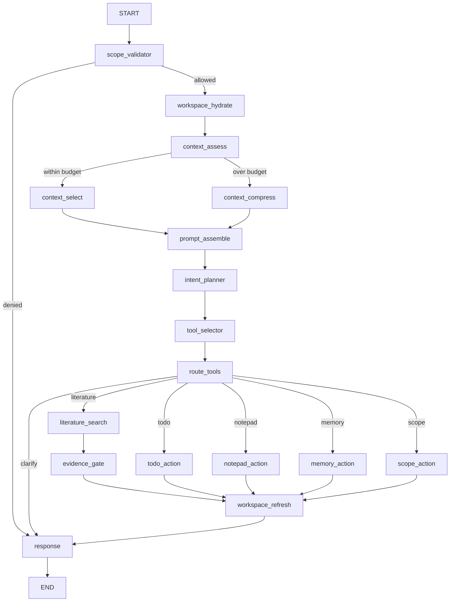

# ResearchAgent HarnessEngineer

> 状态：Harness v1 已接通（2026-08-12）
> 数据边界：`research-workspace/1`  
> 真实部署兼容基线：PostgreSQL 16.14 + pgvector 0.7.4；PostgreSQL 18 保持前向兼容，SQLite 仅用于本地 Demo/测试。

ResearchAgent 是课程内、用户私有的科研工作台。它复用仓库现有
`AgentPlatform`、`BaseAgentRuntime`、Course Access v1 和 LangGraph，不与
Teaching/Prep/Coding Agent 共享可变状态，也不把外部研究结果写入掌握度、推荐、
正式课程 Evidence 或课程图谱。

## 1. 当前真实能力

| 能力 | 实现 | 失败/降级语义 |
| --- | --- | --- |
| 动态 Prompt | 严格角色模板 + 任务模板；变量白名单；运行时只返回版本和 SHA-256 | 未知模板、缺失变量或越权变量 fail-closed |
| Todo | 创建、更新、优先级/位置排序、状态与乐观版本 | 非法状态、跨 workspace 或版本冲突拒绝 |
| 动态工具 | 意图、上下文、运行白名单和课程权限取交集 | 无匹配工具进入 `clarify`，不猜测执行 |
| 上下文 | 相关性筛选、重叠分块、近期保留、token 预算 | 超限进入真实 `context_compress` 分支 |
| Notepad | 用户显式笔记持久化，支持 scope 和版本 | 只允许 owner + course + workspace 联合读取 |
| 压缩 | 可插拔摘要器；当前默认确定性提取式摘要 | 摘要器异常仍保留关键近期片段并标记 degraded |
| Scope | 子任务独立摘要，创建/切换/中断/恢复/完成状态机 | 这是持久化业务状态，不虚报为 LangGraph checkpointer |
| Memory | 短期摘要 + 长期记忆；embedding Port + pgvector 检索 | 未配置/失败时明确返回 keyword degraded |

Semantic Scholar/OpenAlex/Crossref、多源证据综合、学术成文和完整 GitHub 仓库
复现仍未接通，不得按已上线能力展示。主应用没有 shell 工具；未来完整仓库复现必须
进入独立 Reproduction Worker，代码片段只能走 Judge0。

## 2. 真实 LangGraph

`workflow.py` 使用 `StateGraph(ResearchState)`、真实节点和条件边编译。没有用单个
函数伪装“图”，也没有只返回固定成功状态。



每个实际工具节点在执行点重新调用 `ResearchScopePort.validate_scope`，因此 API 的
授权不是 Tool 授权的替代品。`paper_search` 结果继续通过 metadata-only
`EvidenceGate`，并强制携带 `is_supplementary` 与三个 `cannot_modify_*` 边界。

## 3. 目录与依赖方向

```text
research/
├── state.py                 # LangGraph 状态 schema
├── profile.py               # inline 超时、最大并发与工具声明
├── composition.py           # graph factory；只装配 Port
├── workflow.py              # 节点、条件边、响应边界
└── harness/
    ├── prompting.py         # Prompt 模板与安全变量注入
    ├── context.py           # 分块、筛选、预算与压缩
    ├── tooling.py           # Tool Registry 与动态选择
    ├── reliability.py       # 超时、重试、退避、熔断
    └── observability.py     # 结构化节点日志与低基数指标

contracts/research_workspace.py
providers/research/workspace.py
models/research_workspace_model.py
```

依赖方向固定为 `workflow → Port → Provider → SQLModel/外部服务`。Embedding、论文
检索和工作区存储均可替换；bootstrap 只创建 lazy adapter，启动时不加载本地模型、
不调用外网，也不执行 `create_all`。

## 4. 数据库

Alembic `0053` 在空库创建：

- `research_workspaces`
- `research_todos`
- `research_notes`
- `research_scopes`
- `research_memories`

PostgreSQL 先执行 `CREATE EXTENSION IF NOT EXISTS vector`，再创建 `VECTOR` 列。
当前 embedding 维数由配置 Provider 决定，因此使用无固定维数列，并按
`embedding_dimensions` 过滤后执行 `<=>` cosine distance 的精确检索；没有伪造一个
不适用于混合维度的 HNSW 索引。数据规模或模型冻结后，才应为单一维度增加表达式列/
HNSW 迁移。SQLite 保存同一 canonical JSON vector，仅用于 Demo 与迁移回归。

真实部署已只读验证 PostgreSQL 16.14 + pgvector 0.7.4 的 `vector` 类型和 `<=>`
余弦运算符。若某一部署的 vector 扩展、运算符或 SQL 方言不可用，Provider 会回滚该
失败事务并返回 `retrieval_mode=keyword`、`degraded_reason=pgvector_query_unavailable`；
这不改变数据库配置、扩展或服务。

迁移没有历史数据转换。downgrade 只删除本域五张表，保留可能被其他模块共享的
`vector` 扩展。

## 5. API

```http
GET  /api/v1/research-agent/courses/{course_id}/capabilities
POST /api/v1/research-agent/courses/{course_id}/search
GET  /api/v1/research-agent/courses/{course_id}/workspace
POST /api/v1/research-agent/courses/{course_id}/workspace/runs
```

`workspace/runs` 的 `action` 当前支持：

```text
literature_search
todo_create | todo_update | todo_list
notepad_write | notepad_read
memory_store | memory_search
scope_create | scope_switch | scope_interrupt | scope_resume | scope_complete
```

API 只返回 route、所选工具、Prompt 版本/hash、上下文安全摘要、工作区快照与工具结果。
不返回 assembled Prompt、内部完整 trace、密钥或模型原始输出。读取工作台需要
`course.view`；执行需要 `course.question.ask`，Tool 内再次校验。

## 6. 可靠性与可观测性

- `BaseAgentRuntime` 对 generic Agent 执行总超时、最大并发和生命周期事件；Research
  profile 当前是 25 秒、每进程并发 8。
- 外部 Tool 单独执行超时、有限重试、指数退避和 per-tool 熔断；断路时返回稳定错误码。
- `SqlAgentRunEventPort` 记录最小化 run started/completed/failed 事件；节点层输出
  `node/status/latency_ms/error_type` 的结构化日志和进程内低基数计数/耗时快照。
- arXiv Provider 自带 3 秒节流、24 小时缓存、上游不可用降级和 PII 脱敏。
- Memory embedding 不可用不会阻断 Todo/Notepad/Scope，检索明确标记为 keyword degraded。

## 7. 开源方案来源与适配

| 来源 | 复用的成熟模式 | 本项目适配 |
| --- | --- | --- |
| [LangGraph persistence](https://docs.langchain.com/oss/python/langgraph/persistence) / [interrupts](https://docs.langchain.com/oss/python/langgraph/interrupts) | thread/checkpoint 与中断恢复的显式状态模型 | 当前只落地业务 Scope 状态机；未配置 checkpointer，profile 不声明 checkpoint 能力 |
| [Deep Agents](https://docs.langchain.com/oss/python/deepagents/overview) 与 [context engineering](https://docs.langchain.com/oss/python/deepagents/context-engineering) | Todo、文件式上下文、子 Agent、压缩 middleware | 复用 middleware 分层思想，映射到本仓库 Harness/Port；不引入第二套 Agent 平台 |
| [Open Deep Research](https://github.com/langchain-ai/open_deep_research) | 研究与压缩分离、可插拔检索 | 映射为 context branch + PaperSearchPort；保持课程 Evidence 域隔离 |
| [langgraph-bigtool](https://github.com/langchain-ai/langgraph-bigtool) | 先按任务检索工具，再向 Agent 注入小工具集 | 动态选择结果必须再与静态白名单和 Course Access 求交集 |
| [pgvector](https://github.com/pgvector/pgvector) | PostgreSQL 原生 vector 类型与 cosine distance | 复用 `<=>`；混合维度阶段采用精确检索和维度过滤 |
| [LangGraph Postgres saver](https://github.com/langchain-ai/langgraph/tree/main/libs/checkpoint-postgres) | PostgreSQL durable checkpointer 参考实现 | 作为后续 run-level checkpoint 候选；未安装/未装配时绝不宣称可恢复图执行 |

没有复制上述项目的代码，也没有新增未经批准的依赖。

## 8. 验证

从 `backend/` 运行：

```powershell
.\.venv\Scripts\python.exe -m pytest tests/test_research_agent.py tests/research -q
.\.venv\Scripts\python.exe -m ruff check app/platform/agents/research app/platform/agents/providers/research app/models/research_workspace_model.py tests/research
.\.venv\Scripts\python.exe -m alembic heads
```

从 `frontend/` 运行：

```powershell
$env:VITE_ENABLE_SHADOW_FRONTEND='true'
npm.cmd run build
npm.cmd run smoke:app
```

浏览器验收还必须查看真实 DOM、Console 和 Network，不能只凭构建成功宣称页面可见。
