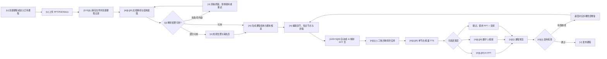
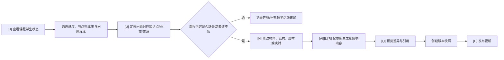

# 角色与核心业务流程

## 1. 角色与边界

| 角色 | 当前核心目标 | 当前可用能力 | 不应默认看到 |
|---|---|---|---|
| 学生 | 选课、连续学习、提问、测验、补学、续接进度 | 课程大厅、PPT/音频/播放器、课程问答、测验、进度、前置跳转 | 教师生产配置、全校用户、Provider 密钥、内部证据 Shadow 工具 |
| 教师 | 把已有资料变成可检查、可播放、可发布的智课 | 上传解析、脚本/节点、PPT 映射、TTS、可选数字人/PPT、发布、学生状态 | 平台级用户角色、生产密钥、研究 Gold/Shadow 控制 |
| 管理员 | 维护用户和角色；内部人员可查看受控证据 Shadow | 用户列表/角色修改；独立 admin Evidence Viewer | 教师内容编辑、学生学习页、尚无接口的统一队列/审计后台 |
| 运维/演示人员 | 决赛前预检、使用受控数据与降级方案 | M7 文档与脚本，分散健康/任务接口 | 产品主导航中的日常业务工作区（当前无完整 UI） |
| 外部平台 | SSO、课程/选课同步、进度回调 | platform endpoints | 本地教师/学生完整 UI 权限 |

标记：`[U]` 用户操作，`[SYS]` 确定性系统动作，`[AI]` AI/外部生成，`[L]` 长任务，`[H]` 人工修改或确认，`[Q]` 质量门禁，`[R]` 可重试点。

## 2. 教师建课主流程

### 2.1 当前实现与目标交互的合并流程



### 2.2 与当前代码的差异

| 流程段 | 当前代码事实 | 目标交互 | 状态 |
|---|---|---|---|
| 上传到解析 | `upload_document` 串联多项工作，页面用上传进度和 toast 表达 | 用持久步骤状态显示进行中、失败、部分成功和重试 | 推导项，兼容现有接口 |
| 解析检查 | 现页有知识树和 parseInfo，但没有 DocumentIR 级逐页质量 | 先显示 V1 可得摘要；未来接页/块/坐标/告警 | 规划中 |
| 结构与脚本 | 已可编辑、保存、版本快照/回滚 | 把 AI 候选与教师确认分开，保留未保存标记 | 已实现，可近期改进 |
| PPT 映射 | 已有独立大弹窗、映射来源/置信度 | 放入同一流水线步骤，右侧显示缺失映射与人工确认 | 已实现，可近期改进 |
| TTS | 已有节点/批量状态，兼容层非耐久 | 任务卡显示总数、成功/失败节点、重试入口 | 部分目标缺接口 |
| 数字人 | 有任务路由与模型，真实部署待验收 | 明确“任务完成”和“教师验收”两个状态 | 部分完成 |
| 预览/发布检查 | 可发布、可用播放器预览；检查单主要在 M7 文档 | 产品化发布清单，但不改变当前发布 API | 推导项 |

### 2.3 发布前置条件（设计目标，不是现有强制规则）

建议阻断项：课程标题/结构存在、至少一个可播放节点、必需映射已确认、失败生成任务已处理、预览可进入。建议警告项：部分节点无音频、数字人未生成、解析有低质量页、AI 内容未逐项确认。当前接口没有统一质量门禁，本轮原型只能模拟，不得改变发布行为。

## 3. 学生学习主流程

```mermaid
flowchart LR
  A["[U] 进入我的课程"] --> B{"是否有历史进度"}
  B -- "有" --> C["[U] 继续上次节点与播放位置"]
  B -- "无" --> D["[U] 从课程开头开始"]
  C --> E["PPT/视频/音频联动学习"]
  D --> E
  E --> F["当前章节、知识点、字幕与原文上下文"]
  F --> G["[U] 向课程智能体提问"]
  G --> H{"回答证据是否充分"}
  H -- "充分" --> I["查看答案、引用与原文定位"]
  H -- "不足" --> J["显示低置信/拒答和反馈入口"]
  I --> K{"是否发现前置缺口"}
  J --> K
  K -- "否" --> L["追问或返回讲解"]
  K -- "是" --> M["[U] 进入前置知识补学"]
  M --> N["系统保留原节点、播放时间、问题上下文"]
  N --> O["完成补学/复习"]
  O --> P["[U] 一键返回原课程锚点"]
  P --> L
  L --> Q["完成测验/检查点"]
  Q --> R["[SYS] 保存学习进度和明确表现证据"]
```



### 3.1 “学习不中断”规则

1. 课程内容始终占主要视觉区域；AI 面板可折叠，不遮挡播放器。
2. 打开引用只显示邻近证据预览；定位原文时在主内容区高亮，不新开多层页面。
3. 进入补学时建立可见返回条，至少保存 `courseId/nodeId/page/playbackTime/questionContext`。
4. 从补学返回后恢复原播放位置和当前问答，不重新初始化课程。
5. 小屏目录和 AI 使用互斥抽屉；关闭抽屉后回到原内容焦点。
6. 低置信回答不以红色“系统错误”呈现，而以“证据不足、建议核对资料/反馈教师”的可恢复状态呈现。

### 3.2 当前支持与缺口

- 已支持：课程路由、PPT/音频、节点目录、课程问答、测验、进度、前置 jump/return API。
- 部分支持：播放器与问答在不同页面；返回接口存在但 UI 未形成持久锚点。
- 未支持：面向学生的稳定 citation/证据 schema、低置信字段、流式服务契约、完整学习事件/记忆。

## 4. 教师处理课程问题流程

该流程只在基础学生状态上部分实现；“高频问题 -> 内容缺口 -> 局部再生成 -> 新版本发布”仍是规划目标。



### 4.1 当前可以做

- 教师历史页可查看课程学生数、平均进度、基础理解度、节点完成率和学生列表。
- 教师可回到课程编辑页修改脚本、映射、音频，并创建脚本快照或回滚。

### 4.2 尚不能声称

- 没有已核验的高频问题聚合、每个回答的学生可见证据链、内容缺失自动归因或课程内容版本发布模型。
- 现有“理解度”受 LLM/流程影响，不能等同于经过验证的知识掌握度。
- 观看时长、问题数或互动语义不能单独驱动自动教学决策。

## 5. 通用长任务状态模型

前端统一表现建议：

```text
not_started -> processing -> generated -> needs_review -> teacher_confirmed
                    |             |               |
                    v             v               v
                  failed       warning        superseded
                    |
                  retrying -> processing
```

- `generated` 只说明系统产物已返回。
- `needs_review` 表示需要教师检查，不能自动等同完成。
- `teacher_confirmed` 才允许计入发布检查。
- `warning` 允许继续但必须说明影响范围。
- `failed` 显示安全错误摘要、受影响对象与局部重试；不展示密钥或内部异常正文。

当前后端任务语义分散，以上是前端设计契约，不能在没有适配层时直接映射为新生产字段。
## 6. 教师治理课程知识与Evidence

~~~text
[系统长任务] 新资料解析为DocumentIR候选
→ [系统] 生成Evidence与知识/关系候选
→ [质量点] 稳定ID、Evidence完整、类型矩阵、先修无环
→ [教师] 在PPT/原文/脚本间核对
→ [教师可修改] 修改名称、别名、映射、关系和审核理由
→ [教师] 接受 / 修改后接受 / 驳回
→ [系统] 计算stale下游影响
→ [教师质量点] 确认待重生成对象和发布范围
→ [系统长任务] 建立新RAG索引/媒体产物
→ [教师] 发布不可变知识快照
→ [系统] 原子切换active pointer
~~~

失败重试点：解析run、页面渲染、候选生成、局部Evidence重建、索引建立。失败时旧active snapshot和旧索引继续服务，不能把失败run切到学生端。

## 7. 教师处理课程问题的产品闭环

~~~text
查看高频问题或no_evidence回答
→ 定位课程、知识点、回答版本和Citation
→ 查看PPT/原文/脚本Evidence
→ 判断：检索失败 / Evidence缺失 / 映射薄弱 / 内容本身缺失
→ 进入知识治理或生产工作台的具体锚点
→ 修改并审核局部内容
→ 计算下游影响
→ 局部重生成和新快照
→ 发布新课程版本
→ 在同类问题上观察RAG质量变化
~~~

教师分析页只负责发现和定位，实际内容修改回到生产/治理工作台；返回分析页时保留筛选和问题上下文。

## 8. 学生建议与Memory透明流程

~~~text
[事实] LearningEvent写入
→ [系统] 生成可回溯LearningEvidence
→ [系统/规则] 生成带evidenceRefs的建议候选
→ [质量点] 无证据不生成强建议
→ [学生] 查看建议、原因、不确定性和证据
→ [学生] 接受 / 稍后 / 不再建议
→ [可选] 经过同意生成Memory候选
→ [学生] 查看、修改、禁止使用或删除Memory
~~~

互动语义只帮助解释困惑上下文，不直接修改MasteryState。Memory关闭后停止生成和使用新条目；删除、导出和审计必须遵守产品接口与隐私政策。
