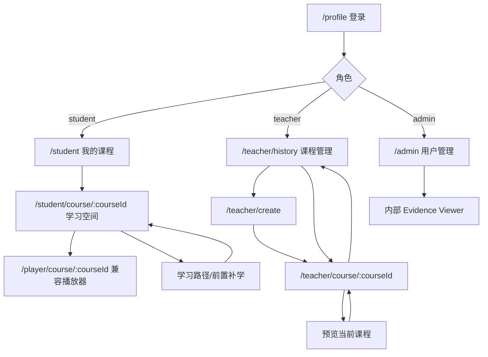

# 角色化信息架构与路由建议

## 1. 设计原则

1. 保留现有公开路由，目标路由通过别名、重定向或查询参数渐进接入，不在决赛前破坏深链。
2. 学生、教师、管理员使用各自工作空间；不设计一个角色看见全部模块的“万能后台”。
3. 课程是教师与学生两侧的主上下文。进入课程后，一级全站导航退居次要，课程名、章节/步骤与保存状态成为持续上下文。
4. 当前不受支持的页面可以进入目标 IA，但必须标注“规划中/推导项”，不能直接加入生产主导航。
5. 产品二、GraphRAG、BKT/HMM/LSTM、复杂多智能体不进入本轮产品一 IA。

## 2. 现状到目标的导航结构

```text
公共区
├─ 首页 /
├─ 登录与个人中心 /profile
└─ SSO 回调 /sso/callback

学生工作空间
├─ 课程大厅 /student                     [已实现]
├─ 课程学习 /student/course/:courseId     [已实现，重点重组]
├─ 独立播放器 /player/course/:courseId    [已实现，兼容保留]
├─ 学习路径 /student/learning-path         [部分能力，规划页面]
├─ 问答记录 /student/questions             [规划页面]
└─ 学习进度 /student/progress              [部分能力，规划页面]

教师工作空间
├─ 课程管理 /teacher/history               [已实现]
├─ 创建课程 /teacher/create                [已实现]
├─ 课程生产 /teacher/course/:courseId       [已实现，重点重组]
├─ 素材管理 /profile?panel=assets           [已实现但入口分散]
├─ 课程学情 /teacher/course/:courseId?view=analytics [部分能力]
└─ 任务中心 /teacher/tasks                  [规划中，缺统一接口]

管理员/内部空间
├─ 用户与角色 /admin                       [已实现]
└─ 内部证据查看 /evidence-viewer/:documentId? [Shadow、admin]
```

## 3. 学生工作空间

### 3.1 一级导航

| 名称 | 当前路由 | 目标路由 | 状态 | 入口 | 返回路径 |
|---|---|---|---|---|---|
| 我的课程 | `/student` | 保持 | 已实现 | 顶部“课程大厅” | 首页或个人中心 |
| 课程学习 | `/student/course/:courseId` | 保持 | 已实现/重点改进 | 课程卡、继续学习 | `/student` |
| 学习路径 | 无 | `/student/learning-path?courseId=` | 部分接口/规划页 | 学习空间目录、个人中心 | 原课程或 `/student` |
| 问答记录 | 无 | `/student/questions?courseId=&nodeId=` | 规划页 | AI 面板“历史” | 原课程 |
| 学习进度 | 无 | `/student/progress?courseId=` | 部分接口/规划页 | 课程卡/个人中心 | `/student` |

### 3.2 学习空间内部层级

```text
/student/course/:courseId
├─ courseId：必需，数字或未来稳定 ID
├─ query node：可选，目标知识节点
├─ query page：可选，PPT/原文页
├─ query t：可选，播放秒数
└─ query context：禁止直接放完整问题正文；只放安全上下文引用 ID
```

桌面内部布局：顶部课程栏 + 左侧目录 + 中央学习内容 + 右侧课程智能体。小屏下目录和智能体变成互斥抽屉；中央内容始终保留。

### 3.3 兼容路由策略

- `/player/course/:courseId` 当前继续保留，不重定向，避免改变已有演示行为。
- 新学习空间完成真实 API 接入后，再评估把“分屏播放器”作为学习空间的全屏模式，而非独立心智模型。
- 原型路径：`/prototype/student-learning/:courseId?`，角色 `student`，只读独立 Mock，不调用生产 API。

## 4. 教师工作空间

### 4.1 一级导航

| 名称 | 当前入口 | 建议目标入口 | 状态 | 说明 |
|---|---|---|---|---|
| 课程管理 | `/teacher/history` | 保持；未来可别名 `/teacher/courses` | 已实现 | 列表、发布状态、学生状态 |
| 创建课程 | `/teacher/create` | 保持；未来可别名 `/teacher/courses/new` | 已实现 | 无 courseId 的生产工作台起点 |
| 课程生产 | `/teacher/course/:courseId` | 保持 | 已实现/重点改进 | 用 `step` 查询参数表达步骤，不拆坏深链 |
| 素材管理 | 个人中心面板 | `/teacher/assets`（后续） | 已实现能力/推导路由 | 本轮不新增生产页 |
| 任务中心 | 无 | `/teacher/tasks` | 规划中 | 统一任务接口前不加入生产主导航 |

### 4.2 课程生产步骤路由

在当前路由上使用可选查询参数，避免一次性新增十个页面和重复加载：

```text
/teacher/create?step=materials
/teacher/course/:courseId?step=overview
/teacher/course/:courseId?step=materials
/teacher/course/:courseId?step=parsing
/teacher/course/:courseId?step=structure
/teacher/course/:courseId?step=script
/teacher/course/:courseId?step=mapping
/teacher/course/:courseId?step=audio
/teacher/course/:courseId?step=avatar
/teacher/course/:courseId?step=preview
/teacher/course/:courseId?step=publish
```

| step | 依据 | 当前接入 | 主要出口 |
|---|---|---|---|
| overview | `Course` | 是 | materials/preview |
| materials | 上传、asset | 是 | parsing |
| parsing | V1 解析 + DocumentIR 规划 | 部分 | structure/重试 |
| structure | knowledgeTree、ScriptNode | 是 | script |
| script | save/snapshot/rollback | 是 | mapping/audio |
| mapping | mapping API | 是，当前弹窗 | audio |
| audio | TTS 接口与轮询 | 是 | avatar/preview |
| avatar | video-gen task | 部分 | preview/重试 |
| preview | 学生播放器 | 部分 | publish/返回修改 |
| publish | publish/unpublish | 接口有，检查单无 | 课程管理 |

原型路径：`/prototype/teacher-pipeline/:courseId?`，角色 `teacher`，只使用隔离 Mock。

### 4.3 教师分析入口

当前学生状态存在于 `TeacherHistory.vue` 的课程内面板。近期建议先保持：

```text
/teacher/history?courseId=:courseId&panel=students
```

若以后获得问题聚合与证据接口，再新增：

```text
/teacher/course/:courseId?view=analytics&tab=progress|questions|content-gaps
```

`questions` 与 `content-gaps` 在接口完成前只能显示“数据尚未接入”，不得用 Mock 混入生产统计。

## 5. 管理员与运维边界

| 页面 | 路由 | 当前状态 | 权限 | 是否进入本轮导航 |
|---|---|---|---|---|
| 用户与角色 | `/admin` | 已实现 | admin | 是，名称保持“用户管理” |
| 内部证据 Viewer | `/evidence-viewer/:documentId?` | V2 Shadow | admin/internal | 否，保留独立入口 |
| 课程审核 | `/admin/courses` | 无充分接口 | 待确认 | 否 |
| Provider 状态 | `/admin/providers` | 分散 health/status | admin/ops 待定 | 否 |
| 任务队列 | `/admin/tasks` | 无统一列表 | admin/ops 待定 | 否 |
| 审计记录 | `/admin/audit` | 无产品化接口 | admin/ops 待定 | 否 |

管理员可以是教师/学生的另一个业务身份，但不应因此在同一个侧栏同时展示三套工作区。应通过明确的“切换工作空间”进入对应角色上下文。

## 6. 页面跳转关系



## 7. 权限矩阵

| 能力 | 未登录 | 学生 | 教师 | 管理员 |
|---|---:|---:|---:|---:|
| 首页/关于 | 允许 | 允许 | 允许 | 允许 |
| 个人中心 | 允许登录 | 自己 | 自己 | 自己 |
| 学生课程/学习 | 否 | 允许 | 否 | 仅切换到学生工作区后 |
| 教师课程生产 | 否 | 否 | 允许 | 仅切换到教师工作区后 |
| 用户角色管理 | 否 | 否 | 否 | 允许 |
| 内部 Evidence Viewer | 否 | 否 | 否 | 允许且受 feature flag |
| Provider/任务/审计 | 否 | 否 | 否 | 当前无完整页面/待确认 |

前端权限只控制可见性与导航；后端必须继续校验用户/角色/课程归属，不能依赖路由守卫作为安全边界。

## 8. 面包屑与返回规则

### 8.1 面包屑

- 普通页面：`工作空间 / 页面`，例如 `教师工作台 / 课程管理`。
- 课程页面：`课程管理 / 数据结构与算法 / 教学脚本`。
- 学习页面不展示长面包屑，顶部只保留：`返回我的课程` + `课程名` + `章节 / 知识点`。
- 原型页面顶部必须显示 `设计原型 · Mock 数据`，防止截图被误当生产结果。

### 8.2 返回优先级

1. 补学返回：恢复保存的原课程锚点，不使用浏览器随意后退。
2. 引用关闭：回到触发引用的答案和焦点。
3. 教师步骤返回：保持 courseId、未保存状态和后台任务，不销毁整个页面。
4. 页面级返回：学习空间回 `/student`；生产工作台回 `/teacher/history`。
5. 深链直达无历史时，返回按钮仍使用上述稳定父路由。

## 9. 页面命名规则

- 面向用户使用任务名称：`课程学习`、`教学脚本`、`发布检查`，避免内部名 `RAG Pipeline`、`TaskRunner`。
- “知识结构树”用于当前章节/节点树；“教育知识图谱”仅用于未来有本体、证据、审核和快照的能力。
- “理解度”保留当前兼容文案时必须附数据来源；新设计优先使用“本次表现/完成情况”，不冒充稳定掌握度。
- AI 状态使用“AI 生成中/AI 候选/低置信”，人工状态使用“待教师检查/教师已确认”。
## 10. 完整产品目标信息架构

本节描述教师端与学生端的目标产品结构。它不等于一次性重写范围；每个页面仍按“现状兼容、近期产品化、可信能力接入、研究晋级”四个层级实施。

### 10.1 学生端

~~~text
学生工作空间
├─ 学习首页
│  ├─ 继续学习
│  ├─ 待完成练习
│  └─ 有依据的复习建议
├─ 我的课程
│  ├─ 在学课程
│  ├─ 已完成课程
│  └─ 可选课程
├─ 课程学习空间
│  ├─ 跟随讲解：视频/数字人主画面 + 当前PPT辅助画面
│  ├─ 课件研习：PPT主画面 + 笔记
│  ├─ 课程目录与知识锚点
│  ├─ 课程智能体与引用
│  └─ 前置补学与原位置恢复
├─ 练习与复习
│  ├─ 待完成练习
│  ├─ 错题重讲
│  └─ 推荐复习
├─ 学习记录
│  ├─ 学习活动
│  ├─ 历史问答
│  └─ 证据与反馈
└─ 个性化与隐私
   ├─ 学习建议及其依据
   ├─ 智能体Memory
   └─ 个性化开关与删除
~~~

### 10.2 教师端

~~~text
教师工作空间
├─ 教师首页
│  ├─ 需要处理
│  ├─ 最近课程
│  └─ 长任务摘要
├─ 课程管理
│  ├─ 课程列表
│  ├─ 新建课程
│  └─ 课程状态与版本
├─ 课程生产工作台
│  ├─ 素材与解析
│  ├─ 结构与脚本
│  ├─ PPT映射
│  ├─ TTS/数字人
│  └─ 预览与发布检查
├─ 课程知识与证据治理
│  ├─ 知识点与关系候选
│  ├─ PPT/文档/脚本证据
│  ├─ 人工审核
│  ├─ 快照与版本
│  └─ 下游失效影响
├─ 学情与课程质量
│  ├─ 学习参与和完成
│  ├─ 作答表现与重复困惑
│  ├─ 高频问题
│  └─ RAG/引用质量
├─ 任务中心
└─ 素材与教师形象
~~~

## 11. 目标路由与兼容策略

目标路由使用更清晰的复数资源命名；现有路由在迁移期作为alias或兼容入口保留，不强制重定向正在使用的深链。

| 页面 | 目标路由 | 兼容入口 | 状态与实施策略 |
|---|---|---|---|
| 学生首页 | /student | 当前/student | 近期重组；课程列表能力已实现 |
| 我的课程 | /student/courses | /student内课程区 | 新增子路由或页内视图 |
| 课程学习 | /student/courses/:courseId/learn | /student/course/:courseId、/player/course/:courseId | 先复用现有接口，旧路径保留 |
| 课程复习 | /student/courses/:courseId/review | 学习空间的补学/练习入口 | 推导项；共享学习上下文 |
| 历史问答 | /student/questions | 当前学习页对话历史 | 接现有历史接口后开放 |
| 学习记录 | /student/activity | 当前进度组件 | 需聚合适配层 |
| 学习建议 | /student/recommendations | 首页建议区 | 仅证据充分且通过晋级门禁后开放 |
| Memory与隐私 | /student/settings/memory | 隔离组件，无正式路由 | 需授权、删除和审计接口后开放 |
| 教师首页 | /teacher | 当前重定向/teacher/history | 新工作台壳稳定后调整重定向 |
| 课程管理 | /teacher/courses | /teacher/history | 先以alias兼容 |
| 新建课程 | /teacher/courses/new | /teacher/create | 先以alias兼容 |
| 课程生产 | /teacher/courses/:courseId/production | /teacher/course/:courseId | 查询参数step保持步骤状态 |
| 知识与证据治理 | /teacher/courses/:courseId/knowledge | 现有MappingEditor弹窗 | 第三个P0核心页面；先接V1 mapping，再接Evidence/图谱审核 |
| 课程预览 | /teacher/courses/:courseId/preview | 生产工作台内预览 | 可先保持嵌入式 |
| 版本与发布 | /teacher/courses/:courseId/versions | 当前脚本快照/发布操作 | 需补全影响范围和快照语义 |
| 学情与质量 | /teacher/courses/:courseId/analytics | TeacherHistory学生面板 | 分阶段开放progress/questions/rag tabs |
| 任务中心 | /teacher/tasks | 各页面局部轮询 | 统一任务查询接口完成后开放 |
| 素材库 | /teacher/assets | /profile?panel=assets | 后续迁移，旧入口保留 |

正式导航只显示用户当前有权限且后端能力已接通的页面。规划页面可以存在于设计文档和开发环境，但不能以空壳形式进入生产主导航。
