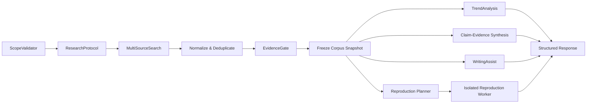
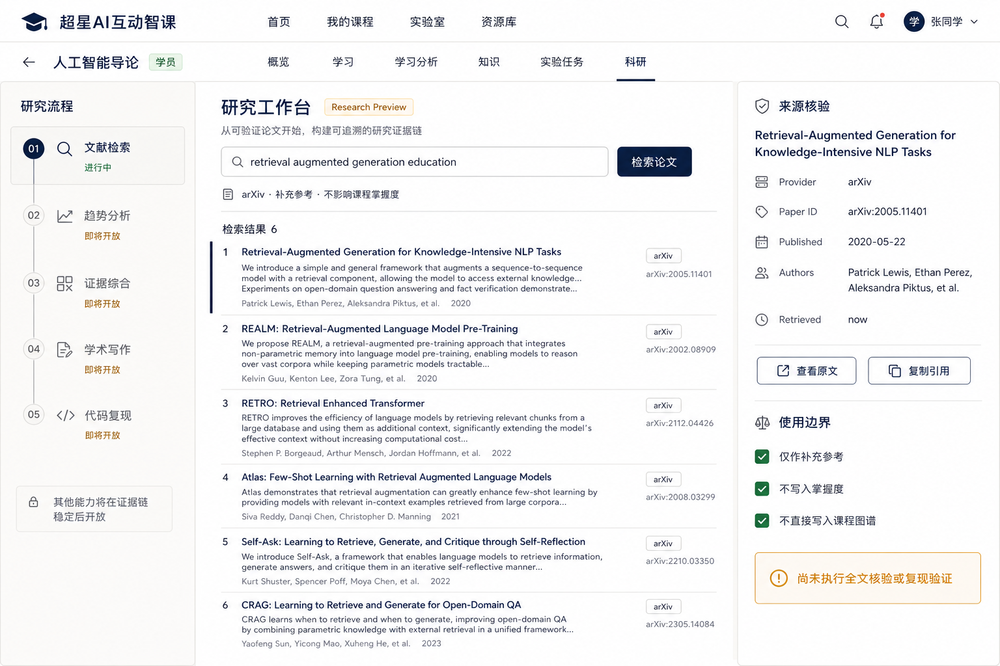

# ResearchAgent 整体架构、前端与上线基线

> 状态：现行实施基线（2026-08-07）  
> 变化原因：挑战杯“揭榜挂帅”助研场景需要从产品构想进入可运行、可审计、可逐步上线的实现。  
> 代码证据：`backend/app/platform/agents/research/`、`backend/app/api/v1/endpoints/research_agent.py`、`frontend/src/app/pages/course/research/ResearchWorkspacePage.vue`。  
> 当前完成度：仅 P0 文献元数据检索闭环 available；趋势、综合、写作与代码复现均为 `research_preview`，不得按已实现能力宣传。

## 1. 结论

ResearchAgent 是第四个物理隔离的 Agent，按 `course_id + actor_user_id` 运行，服务于课程内的助研场景。它不是 TeachingAgent 的 WebResearch 节点，也不是一个“万能聊天框”。它以研究问题、检索协议、来源快照、主张—证据链接、写作版本和复现实验为核心对象。

当前主流程冻结为：

```text
Course Access v1
  → ScopeValidator（课程范围、权限、PII 脱敏）
  → LiteratureSearch（多源论文元数据检索）
  → SourceNormalization（DOI / arXiv ID / 版本去重）
  → EvidenceGate（来源、撤稿/更新、全文可得性、证据级别）
  → 可选并行分支
      ├─ TrendAnalysis（冻结语料的确定性统计 + 有证据的归纳）
      ├─ EvidenceSynthesis（主张—证据矩阵）
      ├─ WritingAssist（证据 ID 约束的结构与草稿）
      └─ CodeReproduction（隔离队列 + 固定提交 SHA + 可复现产物）
  → Response（结构化结果、引用、边界、失败/降级状态）
```

外部论文和网页永远先进入 Research Evidence Domain，标记为补充参考。它们不能直接修改学习掌握度、学习推荐、正式课程 Evidence 或课程知识图谱。若教师希望纳入课程，只能创建可审核 Proposal，再走现有 Evidence/Graph 审核与发布链。

## 2. 开源与官方能力研究

研究优先选择“可借鉴的架构模式”，不因为项目流行就直接引入依赖。所有新增依赖仍须单独批准。

| 来源 | 可借鉴能力 | 采用方式 | 不直接照搬的原因 |
| --- | --- | --- | --- |
| [Stanford STORM](https://github.com/stanford-oval/storm) | 多视角问题探索、知识策展、先大纲后成文、协作研究图 | 借鉴阶段拆分、研究问题树和人机协作 | 其生成文章也明确不是可直接发表成果；本项目必须增加课程权限、证据门和状态机 |
| [FutureHouse PaperQA](https://github.com/Future-House/paper-qa) | 先检索/排序证据片段，再生成带引用回答；科学问答评测 | 借鉴 evidence-first、引用 ID、检索缓存和回答评测 | 不把本地课程 Evidence 与外部论文索引混成一个域；首版也不新增其依赖栈 |
| [LangChain Open Deep Research](https://github.com/langchain-ai/open_deep_research) | 可配置检索源、研究与压缩分离、报告生成、基准评测 | 借鉴 Provider 可插拔和研究/压缩/报告分层 | 本仓库已有 LangGraph Runtime、Provider 和治理层，不引入第二套 Agent 平台 |
| [SWE-ReX](https://github.com/SWE-agent/SWE-ReX) | 隔离运行环境、远程/本地容器、会话管理 | 作为完整仓库复现 Worker 的候选参考 | Judge0 与 SWE-ReX 适用范围不同；依赖和沙箱部署必须另行审批 |
| [CORE-Bench](https://github.com/siegelz/core-bench) / [PaperBench](https://github.com/openai/preparedness/tree/main/project/paperbench) | 固定论文、隔离环境、代理执行、独立评分容器 | 借鉴“执行环境与评分环境分离”、任务清单和产物审计 | 基准集不能证明本项目真实科研质量；不得把离线分数写成上线效果 |
| [LiveDRBench](https://github.com/microsoft/livedrbench) / [DeepResearchBench](https://github.com/Ayanami0730/deep_research_bench) | claim 级中间产物、引用准确率/召回率、长报告评测 | 作为综合与报告阶段的离线验收设计参考 | 需要构造本项目中文课程场景的授权合成集 |
| [Vale](https://github.com/errata-ai/vale) / [Pandoc](https://github.com/jgm/pandoc) | 可配置学术语体检查、Markdown/LaTeX/CSL/BibTeX 转换 | 后续作为确定性写作工具候选 | 当前未安装，不能在 P0 页面伪装为可用 |

### 2.1 学术数据源决策

1. **arXiv**：P0 主源。官方 [API 手册](https://info.arxiv.org/help/api/user-manual.html) 提供 Atom 检索、分页和排序；同一查询至少缓存一天，请求间隔不少于 3 秒。无需密钥，适合作为最小真实闭环。
2. **Semantic Scholar**：P1 的引用、作者、推荐和更广学科元数据源。按 [官方 API](https://www.semanticscholar.org/product/api) 以服务端密钥接入，遵循返回的速率限制；密钥不得进入前端、日志或测试。
3. **OpenAlex**：P1 的主题、机构和开放获取元数据备选。按 [官方 API](https://developers.openalex.org/api-reference/introduction) 使用 `select`、cursor 和批量请求，控制额度。
4. **Crossref + Crossmark**：P1 用于 DOI 规范化、更新/更正/撤稿状态。遵循 [REST polite pool](https://www.crossref.org/documentation/retrieve-metadata/rest-api/access-and-authentication/)；撤稿与更新信息读取 [Crossmark](https://www.crossref.org/services/crossmark/) / Retraction Watch 元数据，不能仅依赖论文标题字符串判断。
5. **GitHub**：仅在用户明确进入“代码复现”且给出仓库后访问。下载必须固定 commit SHA，遵循 [Contents/Archive API](https://docs.github.com/en/rest/repos/contents) 和速率限制；不得执行默认分支上的漂移代码。

## 3. 对原始构想的代码审计修正

| 构想 | 实际代码事实 | 现行决策 |
| --- | --- | --- |
| 复用 `WebResearchPort` 做论文检索 | 该 Port 包装 `web_research_service`，课程默认关闭，只处理白名单网页补充参考，没有论文标识、作者、版本、DOI 或引用网络 | 新增独立 `PaperSearchPort`；WebResearch 仍只服务 TeachingAgent 补充问答 |
| 趋势图谱直接复用课程 GraphRAG | 课程 `CourseKnowledgeBundle` 是正式课程事实的不可变发布物 | 新建 Research Evidence Graph；只在教师确认后生成课程图谱 Proposal |
| Judge0 复现 GitHub 项目 | 当前 `SandboxPort` 只读已有执行结果；Judge0 面向限制语言和单次提交，无法表达完整依赖环境、数据集、GPU、服务与许可证 | Judge0 仅用于算法片段/基准函数；完整仓库进入独立 Reproduction Worker |
| 复用 `codebench.py` | 当前文件只有注释，无注册路由或服务 | 不作为实现依据；基准任务使用新 ReproductionRun 状态机 |
| 复用 `evidence_v2.py` 存论文 | 该 API 属于课程内 Evidence DTO 与 Course Access 语义 | Research Evidence 独立持久化；跨域只能创建审核 Proposal |
| 前端直接复用 `VisualizationView` | 现有可视化主要服务白名单算法；Chart.js 已安装 | 研究统计使用确定性聚合 + Chart.js；不让 LLM 生成图表数值 |

## 4. 物理架构

```text
backend/app/platform/agents/
├── research/
│   ├── state.py          # ResearchState，自有状态
│   ├── profile.py        # AgentType.RESEARCH、HYBRID、并发/超时
│   ├── workflow.py       # 当前 4 节点 P0 图
│   └── composition.py    # Port 装配，不持有请求 Session
├── contracts/
│   ├── research.py       # PaperSearch / TrendAnalysis / CodeReproduction
│   └── writing.py        # LiteratureReview / PaperStructure
└── providers/research/
    ├── access.py         # Agent 边界内再次执行 Course Access
    └── paper_search.py   # 当前 arXiv Provider

backend/app/api/v1/endpoints/research_agent.py
frontend/src/app/pages/course/research/ResearchWorkspacePage.vue
```

ResearchAgent 复用 `AgentProfile`、`LangGraphAgentRuntime`、`AgentPlatform`、超时/降级语义和 Course Access v1；不共享 Teaching/Prep/Coding 的可变 State。P0 不依赖 LLM，应用启动只注册 Provider，不做网络健康检查，不会因 arXiv 不可达阻塞启动。

### 4.1 Runtime scope

- API scope：`(course_id, actor_user_id)`，防止后续用户项目状态串扰。
- API 先授权，`ResearchScopePort` 在 `ScopeValidator` 内再次授权；内部直接调用 AgentPlatform 也不能绕过 Course Access。
- 已编译图是无可变状态的，可由 `share_runtime_across_actors=True` 复用定义；请求身份仍只存在于 `ResearchState`。
- 当前 Search 为 inline，完整趋势、综合和复现必须进入 durable task；Profile 预留 `HYBRID`。
- 研究 API 必须先经 `course_access_service.require_course_permission`；`User.role` 和 `Course.teacher_id` 不参与兜底。

## 5. 工作流与状态机

### 5.1 P0 已实现

```text
ScopeValidator
  - course_id 格式
  - course.question.ask 权限（API + Agent 内部双门）
  - 查询长度
  - PII 脱敏（复用 sanitize_query）
LiteratureSearch
  - ArxivPaperSearchProvider
  - 1..20 条
  - 3 秒进程内请求节流
  - 同查询 24 小时进程缓存
EvidenceGate
  - paper_id/title/source_url 缺失即拒绝
  - evidence_status=metadata_only
  - 强制 supplementary / cannot_modify_*
Response
  - success/no_results/degraded/invalid_request
  - 不生成综述、不虚构论文
```

### 5.2 P1–P4 目标图



节点间只传结构化 ID 和最小化摘要；完整 PDF、数据集、日志和产物通过 `object_key` 与独立权限访问。LLM 输出必须通过 Pydantic schema；失败只允许有限结构化修复，不能把自由文本直接写入主张或图谱。

## 6. 数据域与建议模型

P0 只返回临时结果，没有新增数据库结构。P1 才可在迁移中增加以下模型；迁移必须可重入、带 batch/rollback，不能启动时 `create_all`：

| 模型 | 核心字段 | 约束 |
| --- | --- | --- |
| `ResearchProject` | course_id, owner_user_id, title, research_question, status | 课程成员隔离；用户拥有写权限 |
| `ResearchProtocol` | project_id, inclusion/exclusion, date_range, sources, version | 修改生成新版本，保证检索可重演 |
| `ResearchRun` | project_id, protocol_version, provider_status, query_hash, trace_id | 不存完整 Prompt/LLM Trace |
| `ResearchPaperSnapshot` | provider_id, DOI/arXiv ID, metadata, retrieved_at, source_version | 来源+版本去重；原始元数据可审计 |
| `ResearchCorpusSnapshot` | project_id, paper_ids, filter decisions, content_hash | 冻结后不可变；趋势/综述引用同一快照 |
| `ResearchClaim` | claim_text, status, confidence_label | 只能是 candidate/contested/supported，不写“事实”布尔捷径 |
| `ResearchEvidenceLink` | claim_id, paper_id, locator, stance, verification_level | 支持/反对/背景；必须有页码/段落或摘要级标记 |
| `WritingArtifactVersion` | project_id, kind, content_object_key, evidence_ids, version | 每次生成新版本，不覆盖旧稿 |
| `ReproductionRun` | repository_url, commit_sha, environment_hash, task_id, status | 只保存安全摘要；日志/产物走 object_key |
| `ResearchActionProposal` | source_claim_ids, target_course_id, action, status | 教师确认后才可能进入课程 Evidence/Graph |

Research Conversation 若后续需要，必须创建独立保留策略；不得借用 TeachingAgent 的 `conversation_messages`。研究分析只消费结构化 Research Evidence，不以聊天原文为事实。

## 7. 检索、证据与趋势

### 7.1 多源检索

- Query Planner 输出检索词、同义词、排除词和学科/日期范围；用户可编辑后执行。
- 每个 Provider 独立限流、退避、熔断、缓存和 provenance；单源失败返回 partial success。
- DOI、arXiv ID、Semantic Scholar Paper ID 和标题指纹用于去重；保留版本关系，不静默覆盖。
- 排序分数分解展示：文本相关性、时间、引用、开放获取、来源覆盖；不得只有不可解释的 LLM 分数。
- 系统综述模式参考 [PRISMA](https://www.prisma-statement.org/) 记录发现、去重、筛选、排除理由；普通快速综述不冒充系统综述。

### 7.2 Research Evidence Graph

Research Graph 的节点是 Paper、Author、Topic、Method、Dataset、Metric、Claim、Repository、ReproductionRun；边带 `source_snapshot_id + locator + extractor_version + review_status`。LLM 只产候选边。趋势图、主题聚类和共引关系均从冻结 Corpus Snapshot 重算。

课程 GraphRAG 与 Research Graph 只通过 Proposal Bridge 连接：

```text
ResearchClaim + EvidenceLinks
  → teacher review
  → CourseEvidence proposal
  → existing Evidence/Graph review
  → new immutable GraphSnapshot
```

### 7.3 趋势分析

先确定性计算再用 LLM 解释：

- 年度论文数、主题占比、作者/机构和引用网络；
- 关键词/嵌入聚类的版本、参数和样本数；
- 增长率必须同时给出基数，样本太少标 `insufficient_evidence`；
- LLM 只能引用统计结果 ID 与论文证据 ID，不能生成图表数值；
- 前端 Chart.js 只消费服务端 schema，不执行任意绘图代码。

## 8. 学术写作辅助

WritingAssist 不是代写器，核心交互是“主张—证据—段落”矩阵：

1. 用户选择 ResearchCorpusSnapshot 与写作类型；
2. Agent 生成可编辑大纲，每节列出问题、主张候选、支持/反对 Evidence ID；
3. 证据不足的节保持 `evidence_gap`，不得补写虚构引用；
4. 生成段落时句子级绑定 Evidence ID；引用解析由 DOI/arXiv 元数据完成；
5. Vale、LaTeX linter、Pandoc/CSL 属确定性工具，输出建议或构建日志；
6. 导出前运行引用存在性、孤立引用、未引用条目、重复 DOI 和撤稿/更新检查。

模板库只存结构与约束，不存“万能论文”。首批模板建议：课程研究报告、实验报告、快速文献综述、系统综述协议、算法复现实验报告。

## 9. 代码复现与基准测试

### 9.1 两级执行面

| 类型 | 执行面 | 示例 |
| --- | --- | --- |
| 算法片段、单函数 benchmark | 现有 Judge0 | 排序算法、指标计算、受限语言测试用例 |
| 完整 GitHub 仓库、依赖环境、数据集 | 新增隔离 Reproduction Worker | 论文仓库安装、命令编排、产物验证 |

完整复现最小协议：

```text
Repository URL
  → license / size / secret / malware policy preflight
  → resolve immutable commit SHA
  → build isolated network-denied environment
  → fetch allowlisted artifacts before network is closed
  → run declared steps under CPU/RAM/time/disk limits
  → collect logs, environment lock, outputs and metrics
  → independent verifier compares expected artifact schema
  → emit RO-Crate-style manifest and status
```

研究对象与运行环境可参考 [RO-Crate](https://www.researchobject.org/ro-crate/specification.html) 打包，provenance 语义参考 [W3C PROV](https://www.w3.org/TR/prov-primer/)。任何仓库代码都不得进入主应用进程；默认禁止网络、GPU 与凭据，数据集许可证/体积未通过时拒绝。`ACCEPTED` 只能表示验证通过，沙箱不可用返回 `SANDBOX_UNAVAILABLE`。

## 10. API 契约

### 10.1 已实现

```http
GET  /api/v1/research-agent/courses/{course_id}/capabilities
POST /api/v1/research-agent/courses/{course_id}/search
```

`search` 请求：

```json
{
  "query": "retrieval augmented generation education",
  "max_results": 8,
  "cursor": null
}
```

响应只含安全元数据、`trace_id`、状态、provider、retrieved_at、items、cursor、warning 与固定 `source_policy`。不返回内部节点 Trace、完整 Prompt 或密钥。

权限：capabilities 需要 `course.view`；search 需要 `course.question.ask`。代码复现未来还需要 `experiment.run` 且课程 `coding_sandbox=true`。

### 10.2 计划契约

```text
POST /projects
GET  /projects/{project_id}
POST /projects/{project_id}/protocols
POST /projects/{project_id}/search-runs
POST /projects/{project_id}/corpus-snapshots
POST /corpus/{snapshot_id}/trend-runs
POST /corpus/{snapshot_id}/synthesis-runs
POST /projects/{project_id}/writing-artifacts
POST /projects/{project_id}/reproduction-runs
POST /claims/{claim_id}/course-proposals
```

长任务返回 task/run ID 并进入统一任务中心；SSE 只广播阶段、数量、错误码与安全摘要。

## 11. 前端信息架构

入口位于课程 L2：`/app/course/:courseId/research`，显示名“科研”。原因是当前所有权限、Evidence 和实验能力均为课程关系；独立 L1 研究中心要等 ResearchProject 跨课程聚合与访问模型完成后再开放。

页面采用三栏证据工作台：

1. **Local Rail**：文献检索、趋势分析、证据综合、学术写作、代码复现；当前只有文献检索可用，其他显示条件与 `Research Preview`。
2. **中央工作区**：研究问题/检索框、Provider 与数据边界、论文结果行、后续的筛选协议与 Claim Matrix。不是聊天消息墙。
3. **来源核验面板**：标题、作者、Paper ID、DOI、发布日期、检索时间、原文入口、引用元数据和使用边界。



概念稿是布局与密度基准，不是功能完成证明。实际页面必须使用 `design.md` 的 Academic Ink token、三层滚动模型、opacity 过渡、`SfxButton` 和状态组件；不新增渐变、玻璃拟态、全屏模式或原生按钮。

### 11.1 状态

- Loading：结果行 skeleton，保留查询词；
- Empty：解释当前数据源与如何改写问题；
- No results：不推荐虚构论文；
- Partial/Degraded：列出失败 Provider，已有结果仍可核验；
- Permission denied：解释缺失课程能力；
- Research Preview：阶段、限制和退出条件同时展示；
- Retraction/Update：红/琥珀状态必须有图标与文字，不只用颜色。

### 11.2 响应式

1440/1280 保持三栏；1024 缩窄 Local Rail 与 Inspector，但不挤压主结果到不可读。移动端 P0 不承诺完整研究工作台，应显示受限说明或只读来源详情。

## 12. 安全、治理与隐私

- 所有 Tool 在调用前再次校验 course/actor/policy；API 权限不是 Tool 的替代品。
- 查询在发给外部 Provider 前脱敏；不得发送学号、邮箱、手机号、课程成员名单或聊天原文。
- Provider URL 固定或 allowlist，防 SSRF；PDF/仓库下载经过大小、类型、许可证、SHA 和恶意内容检查。
- 自动化测试使用 MockTransport/Fake，不访问真实付费 LLM、Semantic Scholar key、GitHub 私有仓库或 Judge0 外部服务。
- Agent 审计只存 run/trace/provider/status/count/error_code；不持久化完整 Prompt、模型输出和原始下载内容。
- 外部论文只读；任何课程正式写入必须生成高风险 Proposal 并经教师确认。
- 研究生成内容必须标明模型/提示版本、语料快照、生成时间和未核验项。

## 13. 评测与上线门

| 阶段 | 关键指标 | 上线门 |
| --- | --- | --- |
| 检索 | Recall@K、nDCG、去重准确率、Provider 覆盖、超时率 | 课程隔离/PII/限流/缓存/无结果/单源失败测试通过 |
| 证据 | 引用存在率、locator 有效率、claim support precision/recall、撤稿命中 | 无 Evidence ID 不生成强主张；反对证据不能被丢弃 |
| 趋势 | 冻结语料可重演、聚类稳定性、图表数值一致性 | 图表数值与确定性聚合逐项一致；小样本降级 |
| 写作 | citation correctness、citation completeness、无来源主张率、版本可追溯 | 每个事实段落绑定 Evidence；撤稿/孤立引用检查可见 |
| 复现 | 环境构建率、任务完成率、独立验证通过率、资源超限率 | 网络/凭据/资源隔离、固定 SHA、独立 verifier、失败不伪装成功 |

评测集使用授权论文、合成研究问题和公开基准；不得使用真实学生数据。离线基准分数只说明该版本在该数据集上的表现，不得宣传为真实科研准确率。

## 14. 分阶段路线与回滚

### P0（本变更，available）

- 独立 AgentType、State/Profile/Workflow/Composition；
- arXiv Provider、3 秒节流、24 小时进程缓存、元数据规范化；
- 课程权限、PII 脱敏、EvidenceGate、降级语义；
- capabilities/search API、课程 L2 入口、三栏来源核验工作台；
- 单元/API 测试使用 MockTransport，不触网。

回滚：移除 ResearchAgent 路由和课程导航即可；无数据库迁移、无持久化数据。

### P1（项目与多源）

- ResearchProject/Protocol/Run/Paper/CorpusSnapshot 迁移；
- Semantic Scholar/OpenAlex/Crossref Provider；
- DOI/版本去重、Crossmark/撤稿状态、PRISMA screening；
- 项目列表与检索协议 UI。

### P2（趋势与证据综合）

- Research Evidence Graph 与冻结快照；
- 确定性趋势聚合、Chart.js；
- Claim-Evidence Matrix、冲突证据与全文 locator。

### P3（写作）

- 证据约束的大纲/段落；
- 模板、引用格式、Vale/LaTeX/Pandoc 工具链；
- WritingArtifactVersion 与导出验收。

### P4（代码复现）

- Reproduction Worker、GitHub 固定 SHA、环境/数据 manifest；
- Judge0 片段 benchmark 与完整仓库 Worker 分流；
- 独立 verifier、产物 object_key、RO-Crate/PROV 导出。

每阶段独立 feature/capability gate。关闭阶段只隐藏入口并停止新任务，不删除历史快照/产物；部署数据库变更时必须提供 downgrade 与批次标识。

## 15. 当前已知限制

- P0 只覆盖 arXiv；Semantic Scholar、OpenAlex、Crossref 尚未接线。
- 只获取元数据与摘要，不下载/解析全文，不检查撤稿，不生成趋势或综述。
- 缓存是进程内缓存；多实例一致性要在 P1 使用共享缓存或持久化 Run。
- 还没有 ResearchProject、语料快照、主张证据矩阵或写作版本。
- 还没有完整仓库复现 Worker；当前页面必须持续显示未核验提示。
- `ResearchAgent` 的 ToolGovernance per-tool 策略将在第二个真实 Tool 加入前接线；当前仅有固定 arXiv 只读 Provider，API 与 EvidenceGate 双门已生效。

以上限制是当前代码事实，不是待宣传能力。
