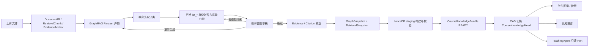

# 课程知识图谱 GraphRAG / Bundle 设计与接口说明

更新时间：2026-07-30

本文描述当前代码和课程 87 已验证运行状态。它是实施说明，不以历史规划、旧
README 或前端文案作为功能完成证据。

## 1. 设计目标与边界

课程知识能力由四类稳定边界组成：

1. GraphRAG 从 Canonical DocumentIR 抽取实体、关系和来源 TextUnit，不重新解析
   PDF/PPT，也不直接产生学生身份。
2. `CourseKnowledgeNode.id <-> node_key(kn_*)` 是课程内稳定知识点身份。GraphRAG
   UUID 只用于一次抽取运行的审计和映射。
3. GraphSnapshot、Evidence/Citation、RetrievalSnapshot 和 LanceDB 索引必须由同一
   `CourseKnowledgeBundle` 版本封装。
4. `CourseKnowledgeHead.active_bundle_id` 是学生图谱、课程检索、认知推荐和
   TeachingAgent 只读 Provider 的唯一正式激活指针。

教师点击“通过”只批准整图及其证据集合。只有 LanceDB 构建和完整性校验成功后，
系统才原子切换 Head。构建失败时旧 Bundle 继续服务。

## 2. 当前实现架构



主要代码边界：

| 模块 | 职责 |
|---|---|
| `app/platform/knowledge/document_ir_exporter.py` | 将真实 DocumentIR 导出为可复现 GraphRAG 输入 |
| `app/platform/knowledge/graphrag_runner.py` | 运行 GraphRAG，或零模型读取既有不可变产物 |
| `app/platform/knowledge/relationship_classifier.py` | 将关系描述分类为教育语义关系 |
| `app/services/graphrag_identity_service.py` | 占位过滤、稳定身份映射、关系去重和质量报告 |
| `app/services/knowledge_bundle_service.py` | 审批、Evidence 闭合、索引、校验、激活和回滚 |
| `app/platform/knowledge/lancedb_provider.py` | 每课程每 Bundle 的真实持久 LanceDB |
| `app/platform/knowledge/sql_lance_provider.py` | SQL 图谱与 LanceDB 的统一只读领域实现 |
| `app/domain/knowledge_bundle/ports.py` | 学生、推荐和 Agent 共享的只读领域协议 |
| `app/platform/agents/providers/retrieval/active_bundle.py` | TeachingAgent 的只读适配器，不提供治理能力 |

## 3. 数据和版本模型

### 3.1 GraphRagRun

一次抽取或确定性精炼的审计记录。重要字段包括运行方法、父运行、模型版本、输入
哈希、产物位置、草稿、质量告警、成本和状态。

`method` 当前包含：

- `standard`：可能调用真实 Completion Provider 的 GraphRAG 抽取。
- `quality-refinement`：只读取父运行的 Parquet 和
  `typed_relationships.json`，不调用 Completion、Embedding 或关系分类模型。
- `legacy-bootstrap`：把迁移前已发布图谱包装成知识包，不能视为 GraphRAG 语义重建。

### 3.2 CourseKnowledgeNode 与 GraphRagEntityMapping

GraphRAG 的 entity ID、`human_readable_id` 和运行内顺序都可能变化，所以不得进入：

- 学生 URL；
- 题库 `knowledge_node_ids`；
- CognitiveState；
- RecommendationRecord；
- 正式 GraphSnapshot 的节点 ID。

正式图谱使用 `node_key=kn_*`，数据库和认知表使用
`CourseKnowledgeNode.id`，二者由同一身份表双向解析。每次 GraphRAG 运行通过
`GraphRagEntityMapping` 记录临时实体到正式身份的映射和方法。

### 3.3 CourseKnowledgeBundle / Head / Activation

Bundle 固定引用：

- `graphrag_run_id`；
- `graph_snapshot_id`；
- `retrieval_snapshot_id`；
- `vector_index_id`；
- 审批和内容哈希。

READY Bundle 不再修改。Head 每课程唯一一行，并以 `lock_version` 做 CAS 更新。
每次发布或回滚都追加 `CourseKnowledgeActivation`，历史 Bundle 和 LanceDB 不删除。

## 4. 身份策略与质量门禁

当前正式策略是 `strict-title-anchor/1.0`：

1. 标准化标题相同且来源 Anchor 有重叠时复用身份。
2. 别名相同、类型相同且来源 Anchor 有重叠时复用身份。
3. 其他情况创建新的 `CourseKnowledgeNode`。
4. 不再按“同类型 + 高 Anchor 重叠”做语义合并。

废弃旧 `semantic_anchor` 策略的原因：一个课件文本块可以同时描述多个概念。只因
共享 Anchor 就复用身份，会把后出现实体的描述覆盖到无关知识点。例如课程 87 的
`ENGINE DISPLACEMENT` 曾被同一来源块中的热能概念覆盖。严格重映射后，该节点描述
恢复为发动机所有气缸工作容积之和。

确定性占位过滤包括：

- `NONE`、`NO_ENTITIES_FOUND`；
- `IMAGE_CONTENT_UNAVAILABLE`；
- `IMAGE<number>`；
- `IMAGE<number>.JPEG/PNG/GIF/BMP/WEBP/SVG` 等图片文件名型标签。

发布前还要求：

- 节点 ID 唯一且全部为本课程 `kn_*`；
- 所有节点和关系都能回到来源 Anchor；
- 关系端点存在；
- 无自环，无重复 `(source, target, type)`；
- `PREREQUISITE_OF` 无环；
- 每条正式关系有 ACTIVE Evidence 或正式教师确认；
- 学生检索结果均能回到可见 Citation。

## 5. 教师治理流程

教师知识图谱治理是整图审批，不支持直接修改节点或关系：

1. `regenerate`：使用教师原因、指令和范围提交新的 GraphRAG 抽取，可能产生模型成本。
2. `refine`：从已有完整产物重新执行严格身份和质量门禁，模型调用数固定为 0。
3. `draft`：读取最新草稿、节点/关系统计、质量报告和原文 Anchor 预览。
4. `approve`：闭合 Evidence/Citation，冻结图谱和检索快照，创建待索引 Bundle。
5. 后台构建 LanceDB 并做行数、维度、自命中、Citation 和 manifest 校验。
6. 校验成功后原子激活；批准响应中的 `activation_pending=true` 表示尚未对学生开放。
7. `rollback`：验证目标历史索引仍完整后，只切换 Head 并追加审计事件。

同一原始产物、同一策略和同一原因的待审 refinement 会幂等复用。某一精炼运行获批
后，同源的其他待审精炼草稿会标记为 `superseded`，已批准历史版本不变。

## 6. HTTP API 与权限

所有课程路由先经过 Course Access v1，不从全局 `User.role` 或旧 Enrollment 兜底。
成功响应使用 `{code, message, data}`；结构化错误码位于 `data.error_code`。

| 方法与路径 | 权限 | 语义 |
|---|---|---|
| `GET /api/v1/graph/course/{id}/knowledge-bundle/draft` | `knowledge.review` + `evidence.review` | 最新教师草稿和 Evidence 预览 |
| `POST .../knowledge-bundle/regenerate` | `knowledge.review` | 新 GraphRAG 抽取，可能调用模型 |
| `POST .../knowledge-bundle/refine` | `knowledge.review` | 零模型严格重映射草稿 |
| `POST .../knowledge-bundle/approve` | `knowledge.edit` + `evidence.confirm` | 整图批准并提交索引任务，不立即激活 |
| `GET .../knowledge-bundle/status` | `knowledge.version.view` | 运行、Bundle、Head 和索引状态 |
| `GET .../knowledge-bundles` | `knowledge.version.view` | 不可变版本列表 |
| `GET .../knowledge-bundles/diff` | `knowledge.version.view` | 两个图谱快照差异 |
| `POST .../knowledge-bundles/{bundle_id}/rollback` | `knowledge.edit` | 原子切换到历史 READY Bundle |
| `GET .../knowledge-bundle/active` | `knowledge.view` | 当前正式 Bundle |
| `GET .../knowledge-bundle/graph` | `knowledge.view` | 当前完整正式图谱 |
| `GET .../knowledge-bundle/nodes/{kn_*}` | `knowledge.view` + `course.citation.read` | 节点、先修/后继和 Citation |
| `GET .../knowledge-bundle/search?q=` | `knowledge.view` + `course.citation.read` | 当前课程 LanceDB 证据检索 |

### 6.1 零模型精炼示例

```http
POST /api/v1/graph/course/87/knowledge-bundle/refine
Content-Type: application/json
Authorization: Bearer <teacher-token>

{
  "parent_run_id": "grr_bc3348e4c9924ab9b5dabbc66b8d88c1",
  "reason": "收紧身份映射并过滤模型占位实体",
  "identity_policy": "strict-title-anchor/1.0",
  "filter_placeholders": true
}
```

返回 `201`，其中 `model_calls=0`、`approval_required=true`、
`activation_pending=false`。草稿必须再次调用 `approve` 才进入索引流程。

### 6.2 主要错误码

| HTTP | `data.error_code` | 含义 |
|---:|---|---|
| 404 | `GRAPHRAG_RUN_NOT_FOUND` | 父运行不存在或不属于课程 |
| 422 | `REFINEMENT_REASON_REQUIRED` | 缺少审计原因 |
| 422 | `IDENTITY_POLICY_UNSUPPORTED` | 请求了未实现的身份策略 |
| 422 | `PLACEHOLDER_FILTER_REQUIRED` | 试图关闭正式占位过滤 |
| 422 | `GRAPH_INPUT_MANIFEST_MISMATCH` | 产物和 Canonical 输入不一致 |
| 422 | `IDENTITY_AMBIGUOUS` | 多个正式身份无法安全判定 |
| 422 | `EVIDENCE_CLOSURE_FAILED` | 图谱来源无法转为正式 Citation |
| 424 | `GRAPH_ARTIFACTS_NOT_FOUND` | 父运行缺少完整 Parquet |
| 424 | `TYPED_RELATIONSHIPS_NOT_FOUND` | 缺少已分类关系产物 |
| 409 | `GRAPH_REFINEMENT_STATE_CONFLICT` | 父运行状态不可精炼 |
| 409 | `ACTIVATION_CONFLICT` | Head 乐观锁冲突 |
| 409 | `INDEX_MANIFEST_MISMATCH` | 索引目录、标记或哈希不一致 |

## 7. LanceDB 和检索

目录布局：

```text
backend/media/knowledge_indexes/courses/{course_id}/
├── runs/{grr_id}/
│   ├── input/input_manifest.json
│   ├── output/*.parquet
│   ├── output/typed_relationships.json
│   └── reports/
└── bundles/{ckb_id}/
    ├── lancedb/
    ├── manifest.json
    └── COMPLETE
```

每个 Bundle 独立存储 `text_unit_embeddings`、`entity_embeddings` 和
`evidence_embeddings`。服务端固定课程和 Bundle 路径，调用方不能指定任意 namespace。
查询只读取 Head 指向的 READY Bundle；索引损坏时失败关闭，不回退到候选 Chunk。

## 8. 学生、推荐与 TeachingAgent 读取

学生 API 通过 `SqlLanceCourseKnowledgeProvider` 读取 Active Bundle。节点路由全程使用
`kn_*`，Citation 仅返回 EXACT/APPROXIMATE 且 `student_visible=true` 的记录。

推荐流程为：

```text
真实答题 -> LearningEvidence -> 六维认知状态 -> 正式 kn_* 薄弱节点
-> Active Bundle 先修关系 -> LanceDB 原文资源 -> RecommendationRecord
```

推荐记录保存 `knowledge_bundle_id`、`graph_snapshot_id`、`vector_index_id`、正式
`knowledge_node_id`、`retrieved_citation_ids` 和检索 trace。答题事务通过 durable
outbox 触发认知和推荐刷新，失败可重试。

TeachingAgent 不修改 workflow/state/tool-governance。配置
`TEACHING_AGENT_KNOWLEDGE_PROVIDER=active_bundle` 后，composition 只注入：

- `ActiveBundleScopePort`：Course Access v1 fail-closed；
- `ActiveBundleKnowledgeGraphPort`：读取节点和关系；
- `ActiveBundleCourseRetrievalPort`：读取 Citation 闭合证据。

这些 Provider 没有发布、激活、编辑节点或转正 Evidence 的方法。

## 9. 课程 87 的真实运行状态

2026-07-30 已验证：

| 项目 | 当前值 |
|---|---:|
| 原始 GraphRAG 运行 | `grr_bc3348e4c9924ab9b5dabbc66b8d88c1` |
| 原始输入 | 318 RetrievalChunk |
| 原始抽取 | 813 entities / 1141 relationships |
| 正式严格精炼运行 | `grr_70f13f76a4874e468cf22ca1a6691fd6` |
| 精炼模型调用 | 0 |
| 过滤占位实体 | 5 |
| 当前 Active Bundle | `ckb_6dbf7fa483b145888f57e094063a27c9`（v4） |
| 当前 GraphSnapshot | 808 nodes / 1137 relations |
| 当前 LanceDB | READY，512 维 |
| text unit / entity / evidence 行数 | 218 / 808 / 218 |
| 当前正式 Evidence / Citation 总数 | 226 / 226 |
| Head lock version | 4 |

运行核验结果：

- 所有 808 个节点 ID 唯一，所有节点和关系都有来源 Anchor；
- 关系无越界端点、无自环、无重复三元组；
- 14 条先修关系通过 DAG 校验；
- `ENGINE DISPLACEMENT` 描述已恢复正确；
- 新进程能读取 v4 LanceDB；
- “发动机排量”查询返回 v4 结果且每条都有 Citation；
- v1、v2、v3 Bundle 和索引仍保留，可按正式回滚接口切换。

## 10. 已知限制与前端未修改说明

本轮按要求没有继续修改前端页面。后端接口、业务语义和课程 87 Active Bundle 已更新，
但当前前端仍有以下体验限制：

1. v4 有 808 个节点，现有画布缺少按社区/层级聚类和渐进展开，大图直接展示的可读性
   和渲染性能有限。
2. GraphRAG 抽取保留大量英文课件标题；后端没有无证据自动翻译或改写正式节点。
3. 个别非明确占位的图片/OCR 实体仍可能语义较弱，需要未来通过可审计质量策略或重新
   生成处理，不能由前端静默隐藏。
4. 教师治理 UI 尚未专门展示 refinement 的完整质量报告和“零模型调用”标识；数据已经
   由 API 返回。
5. 现有前端文件中中断前已有的改动被保留，本轮没有追加、回退或重新验收前端页面。

因此当前后端可作为真实 Bundle 服务和治理接口使用；若要把 808 节点图作为面向普通
用户的正式大图体验，还需要单独安排前端聚类、分层加载、搜索聚焦和性能验收。

## 11. 恢复与回滚

- GraphRAG 原始 Parquet 和 typed relationships 是可重用产物，后处理失败不需要重复付费。
- refinement 报告写入新运行目录，父运行产物不修改。
- staging 未完成时不影响 Active Head。
- 只有 manifest、行数、维度、Citation 自命中和 `COMPLETE` 都通过才设为 READY。
- 应用重启后通过 SQL Head 和 Bundle manifest 恢复读取，不依赖进程内状态。
- 回滚前重新验证历史 LanceDB；成功后只更新 Head 和 Activation，不删除任何目录。
