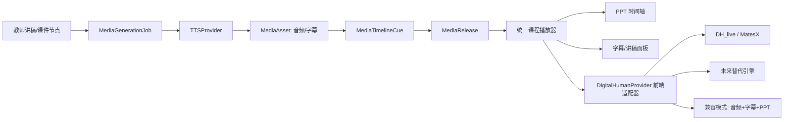

# 阶段8：媒体、TTS、数字人与 PPT 同步 实施规划

> 本文档为阶段8 的实施路线图。核心原则：把"课程媒体时间轴"做成平台能力，把数字人引擎做成可替换 Provider。
>
> **实施状态**：
> - M1（媒体基础与时间轴 + 教师数字人资产中心）✅ 已完成
> - M2（讯飞 TTS 接入）✅ 已完成（后端）
> - M3（数字人引擎抽象与前端壳）✅ 后端部分已完成（前端壳不在后端范围）
> - M4（DH_live 技术验证）⏳ 需真实设备，不在代码范围
> - M5（发布、运维与替换演练）✅ 后端部分已完成
>
> 本文档已按 M1-M5 落地后的最新接口与模块同步。

## 目标边界

首版解决的是"已发布课程讲解"的播放闭环：

```text
教师讲稿
→ TTS 音频
→ 字幕 / PPT 时间轴
→ 学生端数字人或降级播放器
```

不做：

- 聊天时实时生成数字人；
- 在主后端进程运行数字人推理；
- 把某个开源数字人项目的数据格式写进课程核心表；
- 让数字人失败阻断 PPT、字幕或课程播放。

## 一、总体架构



后端只负责"生成、存储、发布、鉴权、时间轴"；前端负责"播放与可选的本地数字人渲染"。

## 二、先冻结通用契约，而不是冻结 DH_live

### 1. TTSProvider

```text
synthesize(request) -> TtsSynthesisResult
```

输入：

- `script_text`
- `voice_id`
- `speed`、`pitch`、`volume`
- `output_format`
- `idempotency_key`
- `course_id`、`resource_version`

输出：

- `audio_object_key`
- `duration_ms`
- `subtitle_segments`
- `audio_sha256`
- `provider_version`
- `warnings`

实现状态（见 `backend/app/services/tts_provider.py`）：

- ✅ `FakeTtsProvider`（`provider_key="fake_tts"`）：M1 自动化测试用，按句切分生成字幕段并写入占位音频到对象存储
- ⏳ `XfyunTtsProvider`（`provider_key="xfyun_tts"`）：M2 接入，讯飞密钥只留在服务端；讲稿按句和 UTF-8 字节限制切分，异步任务执行、可重试、可去重。<https://global.xfyun.cn/doc/tts/online_tts/API.html>
- Provider 注册：`get_tts_provider()` 按 `settings.STAGE8_TTS_PROVIDER` 选择，默认 `fake`

### 2. DigitalHumanProvider

它不负责 TTS，不直接改时间轴，也不接触课程权限；只描述"如何让一个引擎消费已发布音频"。

```text
prepare_avatar(request) -> AvatarPreparationResult
get_playback_manifest(request) -> DigitalHumanPlaybackManifest
health_check() -> ProviderHealth
```

`DigitalHumanPlaybackManifest` 至少包含：

```json
{
  "provider": "dh-live-mini",
  "provider_version": "pinned-commit-or-release",
  "avatar_version": "avatar-2026-001",
  "asset_manifest_url": "protected URL",
  "audio_url": "protected URL",
  "render_mode": "browser_realtime",
  "recommended_quality": "auto",
  "fallback_supported": true,
  "asset_sha256": "..."
}
```

实现状态（见 `backend/app/services/digital_human_provider.py`）：

- ✅ `FakeDigitalHumanProvider`（`provider_key="fake"`）：M1 端到端测试用，生成占位资产包与 manifest
- ⏳ `DhLiveMiniProvider`（`provider_key="dh_live_mini"`）：M4 接入，固定模型/代码版本与哈希
- Provider 注册：`get_digital_human_provider()` 按 `settings.STAGE8_DH_PROVIDER` 选择，默认 `fake`
- `DigitalHumanProviderKey` 枚举已预留 `fake / dh_live_mini / lite_avatar / duil_avatar`

未来更换数字人项目时，只新增 Provider 和前端适配器；`MediaRelease`、时间轴、PPT、字幕和课程 API 不变。

### 3. 前端引擎适配器

```text
DigitalHumanRendererAdapter
  ├─ supports(capabilities)
  ├─ preload(manifest)
  ├─ play(audioClock)
  ├─ pause()
  ├─ seek(ms)
  ├─ setQuality(auto | low)
  ├─ getPerformanceState()
  └─ dispose()
```

DH_live/MatesX 只是其中一个实现。若未来切到其他开源方案，不需要重写课程播放器。

## 三、数据模型与发布机制

M1 已落地的模型（见 `backend/app/models/media_release_model.py` 与 `avatar_model.py`）：

| 模型 | 作用 | 状态 |
|---|---|---|
| `MediaGenerationJob` | TTS、字幕、头像预处理、视频渲染等异步任务，通过 `task_id` 关联统一任务中心 | ✅ M1 |
| `MediaRelease` | 某课程节点对学生可见的不可变发布版本，状态机 draft→active→superseded/withdrawn | ✅ M1 |
| `MediaTimelineCue` | 全局时间轴中的 PPT 页、字幕、讲稿、音频区间 | ✅ M1 |
| `AvatarProfile` | 教师数字人预设：身份、授权记录、引擎和资产版本，按 `owner_user_id` 严格隔离 | ✅ M1 |
| `AvatarSourceMedia` | 原始上传文件登记，仅存 `object_key`，区分形象视频/语音样本 | ✅ M1 |
| `AvatarPreparationJob` | 数字人资产预处理异步任务，含 `idempotency_key` 幂等键 | ✅ M1 |
| `AvatarAssetPackage` | 引擎可消费的资产包：`manifest_object_key`、哈希、支持的渲染模式 | ✅ M1 |
| `CourseAvatarBinding` | 教师预设绑定到课程 MediaRelease，锁定 Provider 与资产包版本 | ✅ M1 |

后续批次预留模型（M3/M5 按需补齐，不在 M1 范围内）：

| 模型 | 作用 | 状态 |
|---|---|---|
| `MediaGenerationAttempt` | 每次重试、失败原因、Provider 版本、耗时。M1 暂以 `MediaGenerationJob.record_attempt` + `AvatarPreparationJob.attempt_count` 承载 | ⏳ M2/M3 |
| `PlaybackCapabilityProfile` | 自动/低资源/兼容模式的配置与实验结果。M1 暂以 `MediaRelease.default_playback_mode` 承载 | ⏳ M3/M5 |

关键约束（M1 已实现）：

- 所有媒体产物只通过 `object_key` 访问，不把本地绝对路径写入业务数据；
- 每次发布形成不可变版本，修改讲稿或头像必须新建版本；
- 删除或重解析资源时，旧版本标为 `stale`，不能静默指向新文件；
- 所有读取继续经过 Course Access v1；
- 将来从本地磁盘迁移 OSS 时，只替换 `ObjectStorageProvider`。

## 四、三档播放体验

### 自动模式

默认模式。前端仅做轻量能力探测：

- 浏览器版本；
- 内存提示能力（可用时）；
- 是否启用硬件加速；
- 首次预加载耗时；
- 渲染初始化、掉帧和音频同步状态。

满足条件才初始化数字人；不能把设备型号、浏览历史等隐私数据上传。

### 低资源模式

降低数字人资源消耗：

- 较低渲染分辨率；
- 减少表情/背景特效；
- 降低渲染频率；
- 资产按需加载；
- PPT、字幕与音频保持完整。

### 兼容模式

数字人完全不初始化，仅提供：

```text
音频 + 字幕 + PPT + 讲稿文本
```

这是正式、完整的教学体验，而不是"播放失败"。学生可手动切换，系统也可在连续掉帧或初始化失败后自动降级。

DH_live 官方确实提供浏览器端运行和 CPU 路线，但最终是否能覆盖旧电脑必须以本项目实机验收为准，不能把其宣传指标当作产品承诺。<https://github.com/kleinlee/DH_live>

## 五、服务部署职责

### Linux 云服务器

部署：

- 主后端、前端、数据库；
- Judge0 独立容器；
- 媒体任务队列；
- 讯飞 TTS 调用适配器；
- 对象存储适配器；
- 媒体、字幕、头像资产的受权限分发；
- 时间轴与发布 API。

不部署：

- 每个学生一条实时数字人推理进程；
- 数字人模型训练；
- 课堂播放期间的服务端逐帧合成。

### 数字人资产预处理 Worker

初版作为独立 Worker，优先 Windows 环境。原因是 DH_live 的离线视频合成支持在 Windows 更完整，而 Linux 更适合托管网页服务和素材。<https://github.com/kleinlee/DH_live>

它只做：

```text
授权头像视频
→ 资产预处理
→ 资产包校验
→ 写入对象存储
→ 更新 AvatarAssetPackage
```

后续若选用支持 Linux 的替代引擎，只替换该 Worker 的 Provider 实现。

## 六、实施批次

### M1：媒体基础与时间轴 ✅ 已完成

- 明确 `MediaGenerationJob`、`MediaRelease`、`MediaTimelineCue` 的迁移、回滚和 API；
- 建立本地 `ObjectStorageProvider`（`LocalStorageProvider`）；
- 完成 PPT、字幕、讲稿和音频的统一播放时钟；
- 先用假音频 Provider 测试，不调用真实讯飞。
- **附加完成**：教师数字人资产中心（`AvatarProfile`/`AvatarSourceMedia`/`AvatarPreparationJob`/`AvatarAssetPackage`/`CourseAvatarBinding` 全套模型与服务、API、41 个端到端测试）

验收：无数字人时，讲稿音频、字幕和 PPT 可按时间轴完整播放、跳转和恢复。✅
回归测试：1634/1635 通过（1 个预存 R2 sidecar 问题与本次无关）。

### M2：讯飞 TTS 接入 ✅ 已完成

- 实现 `XfyunTtsProvider`（讯飞 WebSocket TTS v2 API，含 HMAC-SHA256 鉴权、分帧、音频拼接）；
- 任务队列、幂等、失败重试（`TTS_MAX_RETRY_ATTEMPTS`）、限额（`TTS_RATE_LIMIT_PER_MINUTE`）与人工重跑；
- 音频标准化与哈希（`audio_sha256`）；
- 模拟 Provider（`MockXfyunTtsProvider`）进入自动化测试，真实讯飞仅人工验收。
- 凭据缺失时返回 `DEPENDENCY_UNAVAILABLE`，禁止伪装成功

验收：讲稿变更可生成新的音频资产和字幕 Cue，并发布可回滚版本。✅

### M3：数字人引擎抽象与前端壳 ✅ 后端部分已完成

- ✅ 后端：Provider 健康检查端点（`/providers/health`）、播放模式切换端点（`/playback/switch-mode`）
- ✅ 后端：`auto / low_resource / compatibility` 三种模式 API 支持
- ⏳ 前端：`DigitalHumanRendererAdapter`、播放器状态、手动切换、失败降级（不在后端范围）

验收：即使所有数字人 Provider 不可用，课程播放仍正常。✅（后端 API 层面）

### M4：DH_live 技术验证 ⏳ 需真实设备

- 单一授权头像；
- 固定模型/代码版本与哈希；
- 生成资产包；
- 实装 `DhLiveRendererAdapter`（`DhLiveMiniProvider` 骨架已预留）；
- 用不同年份的 Windows 设备实测。

验收：真实设备数据证明自动模式、低资源模式与兼容模式的分界条件。（需实机验收，不在代码范围）

### M5：发布、运维与替换演练 ✅ 后端部分已完成

- ✅ 媒体版本发布、撤回、回滚（M1 已实现）；
- ✅ 对象存储迁移工具（`migrate_object_keys`、`/storage/migrate` 端点）；
- ✅ Provider 健康检查与开关（`/providers/health`、`DH_PROVIDER_FALLBACK_ON_FAILURE`）；
- ✅ 模拟 DH_live Provider 故障，切换至兼容模式（`/playback/switch-mode`）；
- ✅ 验证新增第二个 Fake/替代引擎无需变更课程核心数据（Provider 替换演练测试通过）。

## 七、必须保留的安全与治理点

- 头像、教师视频和素材包不能入 Git；
- 数字人形象必须有授权与撤销记录；
- 讯飞凭据不能进入前端、日志或测试；
- 媒体 URL 必须按课程权限签发；
- 自动化测试不调用真实讯飞或真实数字人服务；
- 学习行为、TTS/数字人播放日志不能直接写入正式掌握度；
- 数字人效果、帧率必须基于实测报告。
