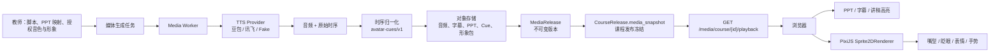

# 阶段8：课程媒体、TTS、PPT 与浏览器数字人架构及执行规划

> 状态：P0 播放、正式 PPT manifest，P1 豆包 TTS Worker 与 P2 Cue 发布冻结均已
> 完成代码接入；P3 PixiJS 2D 渲染器已开始接入学生端，使用平台预制角色和已冻结
> `avatar-cues/v1`。课程 87 尚无可播放的已发布媒体快照，也没有冻结的 PPT 映射，
> 因此不能据此宣称已完成真实学生端或设备性能验收。最后核对：2026-08-01。
>
> 本文以实际注册路由、调用链、模型和一次真实 Provider POC 为证据，不把历史
> Demo、Fake Provider 或未接入的 API 写成已对学生生效的能力。与历史阶段8说明
> 冲突时，以本文和代码实际行为为准；功能完成度仍须以代码、迁移、测试和手工
> 验收共同确认。

## 0. 本次结论

### 0.1 冻结的产品技术方向

```text
讲稿 + 已授权音色 + PPT 映射
  -> 媒体 Worker 异步生成音频、字幕、口型 Cue
  -> 对象存储中的不可变媒体资产
  -> MediaRelease / CourseRelease 冻结引用
  -> 学生端 playback API
  -> HTMLAudioElement.currentTime 作为唯一主时钟
     -> PPT 图片切换
     -> 字幕与讲稿高亮
     -> PixiJS 2D 数字人的嘴型、眨眼、表情、手势
```

- 音频是唯一主时钟。PPT、字幕、知识点定位和数字人都只读取音频时间，绝不以
  视频帧、`setInterval` 或数字人动画作为第二时钟。
- 正式数字人 MVP 使用浏览器端 PixiJS 2D 图集，不把 LivePortrait、Wav2Lip、
  SadTalker、DH_live 或任何逐帧视频合成放入学生播放主链。
- 服务端只做授权、生成编排、时序归一化、对象存储和发布；FastAPI 主进程不传
  大媒体文件、不做逐帧渲染，也不为每位学生启动推理进程。
- 所有 Provider 原始时序都由后端 Worker 转为 `avatar-cues/v1`。浏览器不解析
  豆包 `phonemes`、讯飞 `pybuf` 或任一厂商私有协议。
- 音频、PPT、字幕、Cue、形象包任一项变更都创建新 `MediaRelease`；旧资产版本
  标为 `stale` 或 `superseded`，不会静默替换学生正在学习的版本。

### 0.2 供应商定位（不提前承诺未验能力）

| 能力 | 当前建议 | 可替换条件 |
| --- | --- | --- |
| 预置音色 TTS、短文本试听 | 豆包语音合成 2.0 v3 | `seed-tts-2.0` 的音频和字级时序通过 POC |
| 教师复刻音色 + 口型时序 | 讯飞 `x5_clone` 为首选候选 | 验证 `rhy=1 + pybuffer=1` 同时稳定返回音频与完整时序 |
| 豆包复刻音色 | `seed-icl-2.0` 为备选候选 | 对复刻音色实测 `words` 和非空 `phonemes`，不能只依据字段名 |
| 浏览器数字人 | PixiJS 2D `sprite2d` | 在目标设备实测 480p / 24fps；失败可无缝降级 |
| PPT 呈现 | 后端预渲染图片 + `ppt-manifest/v1` | 不在浏览器解析 PPTX，不绑定第三方播放器 |

讯飞标准版资料明确表明 `x5_clone` 的 `pybuffer` 以 5ms 为单位，适合转换为 24fps
嘴型 Cue。豆包当前官方文档明确支持 v3 音频合成；`enable_subtitle` 的字级时序
只明确保证给 `seed-tts-2.0`，复刻模型的字幕和音素数据必须以 POC 为准。

## 1. 真实现状与差距

### 1.1 已存在且可复用的后端底座

| 模块 | 真实状态 | 证据 |
| --- | --- | --- |
| 媒体任务、尝试审计、发布、冻结 Cue | 已有模型与服务 | `backend/app/models/media_release_model.py`、`backend/app/services/media_release_service.py` |
| 媒体播放清单 | 已注册 `GET /api/v1/media/course/{course_id}/playback` | `backend/app/api/v1/endpoints/media_release.py` |
| 对象存储和签名 URL | 已有 local / S3-compatible 抽象 | `backend/app/services/object_storage.py` |
| 数字人授权、原始素材、资产包、课程绑定 | 已有模型与服务 | `backend/app/models/avatar_model.py`、`backend/app/services/avatar_service.py` |
| Fake / 在线讯飞 TTS Provider | 已有，但不是声音复刻 Provider | `backend/app/services/tts_provider.py` |

`/media/course/{id}/playback` 已能返回音频 URL、字幕段、PPT 页时间轴和可选数字人
manifest。但是它尚未提供可消费的 PPT 图片 manifest，且前端没有调用它；因此不能
表述为“学生已经走新媒体播放链”。

### 1.2 当前学生学习页的真实链路

```text
LearnPage.vue
  -> useLearningWorkspace.js
     -> GET /api/v1/player/init/{courseId}
        -> playerWorkspaceAdapter.js
           -> LectureStage.vue <video>
```

- `LearnPage.vue` 仍向 `LectureStage` 传入 `currentVideoUrl`。
- `useLearningWorkspace.js` 只请求旧 `/player/init`；没有请求 `/media/course/{id}/playback`。
- `LectureStage.vue` 以 `<video>` 的 `timeupdate` 作为进度来源，音频、字幕和数字人
  尚未接入。
- 课程 87 的旧播放器数据中没有可用视频/PPT 图片时，会显示空态。这是媒体未发布
  或旧链无资产的真实结果，不是应由前端伪造填充的状态。

### 1.3 现有 TTS 实现的边界

- 阶段8正式路径以 `STAGE8_TTS_PROVIDER` 选 Provider，默认是 `fake`；当前只注册
  `fake`、`xfyun_tts` 与 `mock_xfyun`。
- `XfyunTtsProvider` 使用在线标准 TTS `wss://tts-api.xfyun.cn/v2/tts` 与 `ora12`，
  不支持 `x5_clone / res_id`，也没有保存或解析 `pybuf`。
- 旧 `backend/app/common/tts_client.py` 的火山 HTTP 客户端及声音复刻训练路径是
  历史兼容代码；它没有实现豆包 v3 双向 WebSocket、`TTSSubtitle` 或时序归一化。
- `backend/app/core/config.py` 尚未声明 `VOLCENGINE_DOUBAO_TTS_*` Settings 字段；
  `backend/.env.example` 中的模板变量不能被正式 Provider 自动消费，必须先补齐。

因此应新增独立的 `VolcengineDoubaoTtsProvider` 与将来的
`XfyunVoiceCloneProvider`，而不是把声音复刻硬塞进现有在线讯飞类，也不把旧火山
HTTP 客户端当作 v3 实现。

## 2. 豆包 v3 限量 POC 记录

### 2.1 本次操作

在用户配置好本地 `backend/.env` 后，执行过受控的短文本（10 个字符）豆包 v3
WebSocket 探测。测试使用：

- `wss://openspeech.bytedance.com/api/v3/tts/bidirection`；
- 已配置的 `seed-tts-2.0`、音色和 API Key；
- PCM 24kHz / 16-bit 单声道，以便不依赖 MP3 解码器直接计算真实时长；
- `enable_subtitle=true`；
- 官方 `TTS Websocket Bidirection protocols` 协议代码解析帧；
- 不保存音频、不打印 Key、音色 ID 或原始响应。

### 2.2 结果

| 次数 | 可确认结果 | 不可据此断言的结论 |
| --- | --- | --- |
| 第 1 次 | 已建连并建会话；合成阶段无音频 | 未记录安全错误码，不能归因 |
| 第 2 次 | Provider 错误码 `55000000`：`resource ID is mismatched with speaker related resource` | 不能据此判断任何其它音色的可用性 |
| 第 3 次 | 已建连、建会话，并收到 `TTSSentenceStart` 与 `TTSSentenceEnd`；45 秒内未收到音频或 `SessionFinished` | 不能判定 TTS、`words`、`phonemes` 或时长误差失败 |
| 第 4 次 | 按官方逐字流式协议成功：PCM 24kHz 音频 113,810 bytes / 2,371.042ms，9 个 `words`，收到 `TTSSubtitle`，无 Provider 错误 | 仅代表当前预置音色与短文本；不代表复刻音色或长文本质量 |

第 3 次揭示探针实现仍未完全遵循官方完整示例：官方示例在 `TaskRequest` 中携带事件
字段，并按文本流逐段发送后等待会话完成；探针仅依赖外层帧事件且一次性传全文，因而
不能以这次超时评价 Provider 或当前音色。随后已将官方帧流程封装为
`backend/scripts/volcengine_tts_poc.py`，其默认 dry-run，只有显式
`--allow-billable-call` 才会发起一次调用；解析协议的本地回归为 3 项通过。

第 4 次的字级最后结束时间为 2,215ms，与 PCM 真实时长的绝对差为 156.042ms。
该差异适合作为字幕与 PPT 同步的初始实测数据，不能假定为所有文本和音色的固定误差。
响应中的 `phonemes` 为空，因此豆包 `seed-tts-2.0` 当前已验证为“预置音色音频 +
字级字幕时间轴”来源，**不**是当前数字人精确口型的时序来源。

### 2.3 当前阻塞与下次 POC 门槛

1. 保持已消除的 Resource ID / speaker 不匹配状态；若后续改用复刻音色，必须同时
   使用 `seed-icl-2.0` 与音色库实际复刻音色 ID。无需将音色 ID 或 Key 发送到对话。
2. 已实现开发专用 `tts_poc` 命令，逐字/逐段发送官方要求的 `TaskRequest` JSON 并
   严格等待 `SessionFinished`。后续修改先运行本地帧 fixture 测试；真实调用仍需要
   用户明确授权。
3. 豆包预置音色已通过音频和 `words` POC，可用于 P0 的音频、字幕与 PPT 链。长文本、
   多语种、复杂公式和复刻音色需要各自限量 POC，不进行自动重复调用。
4. 豆包 `phonemes` 为空，不能用于精确口型。数字人主链仍等待讯飞 `x5_clone` 的
   `pybuffer` 验证，或对豆包 `seed-icl-2.0` 单独验证到非空、可解析的音素数据。

## 3. 正式运行架构



### 3.1 服务职责和资源边界

| 位置 | 必须做 | 明确不做 |
| --- | --- | --- |
| FastAPI | Course Access v1 校验、任务创建、状态查询、版本发布、签名 URL | 逐帧合成、长连接音频转发、大文件下载代理 |
| Media Worker | 一次性 TTS、音频规范化、哈希、字幕/Cue 转换、对象存储写入 | 在播放时实时生成媒体 |
| 对象存储 / CDN | 音频、PPT 图片、Cue JSON、Sprite 图集的分发 | 以绝对本地路径作为业务事实 |
| 浏览器 | 音频播放、PPT/字幕同步、PixiJS 绘制、设备降级 | 调用厂商 TTS、保存厂商密钥、解析厂商私有时序 |

Worker 可以首先是应用外独立进程或已有任务系统的显式消费端；不能继续把真实付费
TTS 放在 API 请求同步执行路径。API 创建任务后返回 `task_id`，前端轮询或 SSE 观察
状态。失败必须保留失败语义，不回退到 Fake 并伪称生成成功。

### 3.2 唯一时间轴规则

正式版的单个 `MediaRelease` 使用一个音频时钟。所有 `start_ms/end_ms` 都是相对于
该 `audio_object_key` 起点的绝对毫秒，不再含糊地解释为“相对知识点音频”。

```text
audio.currentTime * 1000
  -> active node (node time range)
  -> active PPT page
  -> active subtitle / script offsets
  -> active viseme / expression / gesture
```

拖动、暂停、恢复、0.75x/1x/1.5x、切换知识点均以 `audio.currentTime` 为准。播放
倍速只改变音频和浏览器渲染的实时进度，不重写已发布的 Cue。若未来改为“每知识点
一段音频”，必须发布 `audio-playlist/v1` 并定义连续时间到单段偏移的映射；在此之前
不得把两套语义混用。

## 4. 冻结的资产协议

### 4.1 `playback-manifest/v1`

`GET /api/v1/media/course/{course_id}/playback` 的目标返回不是厂商原始数据，而是以下
课程级播放契约。签名 URL 的过期策略由对象存储统一控制。

```json
{
  "schema": "playback-manifest/v1",
  "release_id": "mrel_...",
  "timeline_content_hash": "sha256-...",
  "audio": {
    "url": "signed-url",
    "mime_type": "audio/mpeg",
    "duration_ms": 46320,
    "sha256": "sha256-..."
  },
  "ppt": {
    "manifest_url": "signed-url",
    "timeline": [{"node_id": 12, "ppt_page": 3, "start_ms": 8200}]
  },
  "subtitles": {
    "manifest_url": "signed-url",
    "segments": [{"start_ms": 8200, "end_ms": 10400, "text": "...", "node_id": 12}]
  },
  "avatar": {
    "package_manifest_url": "signed-url",
    "cues_url": "signed-url",
    "fallback_supported": true
  },
  "default_playback_mode": "auto"
}
```

- 无数字人时 `avatar` 为 `null`，音频、PPT、字幕和讲稿仍完整可用。
- `ppt.manifest_url` 是必要补充。当前 API 只返回页码时间轴，不能让新播放器获得已
  冻结的 PPT 图片；暂时从旧 `/player/init` 借用图片只能是 P0 迁移过渡，不可作为
  正式发布真源。
- 字幕清单要保留 `source_offset_start/source_offset_end` 或等价稳定锚点，支持讲稿
  原文高亮，而非仅保存显示文本。

### 4.2 `ppt-manifest/v1`

```json
{
  "schema": "ppt-manifest/v1",
  "source_sha256": "sha256-of-render-source",
  "pages": [
    {"page": 1, "image_url": "signed-url", "width": 1920, "height": 1080}
  ]
}
```

PPTX/PDF 只在建设期渲染成图片；学生端仅绘制图片。页面 URL 必须按课程权限签发，
不得把磁盘路径写入数据库或下发给浏览器。

### 4.3 `avatar-cues/v1`

```json
{
  "schema": "avatar-cues/v1",
  "audio_sha256": "sha256-of-audio",
  "duration_ms": 46320,
  "timing_source": "xfyun_pybuf",
  "timing_source_version": "x5_clone",
  "viseme_set": "course-viseme-8",
  "visemes": [
    {"start_ms": 0, "end_ms": 30, "id": "silence"},
    {"start_ms": 30, "end_ms": 130, "id": "open_large"}
  ],
  "expressions": [
    {"start_ms": 8200, "end_ms": 11000, "id": "encouraging", "weight": 0.4}
  ],
  "gestures": [
    {"start_ms": 9500, "end_ms": 11200, "id": "explain_right"}
  ]
}
```

`audio_sha256` 是硬校验：音频二进制、音色、语速、文本、Provider 版本任一变化均会
使旧 Cue 无效。客户端哈希不一致、Cue 缺失或解析失败时停止数字人渲染，自动进入
静态头像或兼容模式，但绝不阻塞音频、PPT 和字幕。

首版固定 8 类视觉嘴型，避免把厂商音素作为前端协议：

| 音素归类示例 | viseme |
| --- | --- |
| `sil`、`sp` | `silence` |
| `b`、`p`、`m` | `closed` |
| `f` | `teeth` |
| `a`、`ai`、`an`、`ang` | `open_large` |
| `e`、`en`、`eng` | `open_mid` |
| `i`、`j`、`q`、`x` | `wide` |
| `o`、`u`、`ong` | `round` |
| 其余 | `neutral_open` |

### 4.4 `avatar-package/v1`

```text
avatar-package/v1/
  manifest.json
  atlas.webp
  atlas.json
  idle.json
  preview.webp
  license.json
```

首版只提供平台预置、已授权的半身教师形象：身体、眼睛、8 类嘴型、3 类表情和 2 类
手势。教师先选择预置形象和已授权声音；“上传任意真人视频并在 CPU 上自动得到高
质量实时数字人”不属于首版承诺。

## 5. 数据模型、发布与治理设计

### 5.1 在既有模型上的增量

以下为实施时需要 Alembic 迁移的正式增量；不以启动时 `create_all` 替代迁移。

| 对象 | 增量字段 / 语义 |
| --- | --- |
| `MediaGenerationJobType` | 新增 `avatar_cues`；`dh_render` 保留为旧离线视频兼容，不是主链 |
| `MediaGenerationJob.output_metadata` | 只保存小型审计摘要：输入哈希、Provider 版本、计费字数、音频 SHA、Cue object key；不塞入整段音素数据 |
| `MediaRelease` | 新增 `audio_sha256`、`avatar_cues_object_key`、`avatar_cues_sha256`；PPT/字幕 manifest 均引用不可变 object key |
| `MediaReleaseCue` | `start_time/end_time` 统一解释为课程级音频绝对秒；字幕添加稳定文本锚点 |
| 音色资产 | 新增版本化 `VoiceAsset`（或等价表），保存 `provider_key`、`provider_voice_id`、`provider_version`、授权快照、样本哈希、状态；不复用历史 `TeacherAsset.clone_voice_id` 作为跨厂商真源 |
| `MediaGenerationAttempt` | 写入已脱敏 Provider 错误码、耗时、用量、输入哈希和重试原因；不写 API Key、原始音频或完整讲稿 |

数字人形象和声音授权都必须支持撤销。被撤销的 `VoiceAsset` 或 `AvatarProfile` 不能
用于新任务和新发布；已发布版本遵循现有治理策略被标为 `stale`，由教师创建替换版。

### 5.2 幂等、缓存和费用控制

媒体 Worker 的稳定输入键为：

```text
sha256(
  schema_version + provider_key + provider_version + provider_voice_id +
  script_sha256 + speed + pitch + volume + format + sample_rate +
  timing_options + voice_consent_version
)
```

- 同一输入键命中已成功且授权有效的产物时直接复用，不调用付费 Provider。
- 试听只在教师明确点击“生成试听”后创建任务；输入时、学生打开课程时、自动化测试
  都不得调用真实服务。
- 默认单次失败不自动无限重试。超时、配置错误和鉴权错误必须人工确认后重跑；可重试
  的暂时性错误受每课程每分钟、每日字符数和单任务最大尝试数限制。
- Worker 将 Provider 用量写入 Attempt 摘要，建设端展示“本次生成/缓存命中/失败”，
  但不把用量伪装为精确账单。
- 浏览器只预取当前和下一个知识点需要的 Cue/图集，不在首屏下载整门课程的全部资产。
  缓存键至少包含 `release_id + asset_sha256 + renderer_version`，发布变更天然隔离。

Provider 名称未知、配置缺失或健康检查失败时必须返回 `DEPENDENCY_UNAVAILABLE`；当前
`get_tts_provider()` 对未知名字回退 Fake 的历史语义不适用于正式付费生成路径，实施
时须改为明确失败，测试显式传入 Fake。

## 6. 前端播放器设计

### 6.1 P0 组件边界

```text
LearnPage
  -> useLearningWorkspace             # 旧节点/笔记/进度迁移适配
  -> useMediaPlayback                 # playback-manifest/v1、音频时钟、降级状态
  -> LearningMediaStage
       -> AudioTransport               # 原生 <audio>，进度、倍速、音量、seek
       -> PptTimelinePane              # 图片 + 当前页
       -> SubtitleTranscriptPane       # 当前字幕 + 原文高亮
       -> AvatarViewport (optional)    # PixiJS adapter，仅后续 P3 启用
```

`LearningMediaStage` 替换 `LectureStage` 的视频主播放职责。旧 `/player/init` 在 P0
仅暂时供学习轨道、笔记和历史进度迁移使用；一旦 `playback-manifest/v1` 上线，媒体
展示必须以发布快照为真源。

### 6.2 音频控制和同步规则

- 使用一个隐藏或可见的原生 `<audio>`；播放、暂停、seek、倍速、音量都调用该元素。
- `timeupdate` 用于业务状态同步；视觉渲染可在 `requestAnimationFrame` 中读取同一
  `audio.currentTime`，不能维护自己的累计时间。
- PPT 在页面 `start_ms <= now < next_start_ms` 时切换；字幕使用相同范围查询，并以
  二分索引避免每帧遍历完整数组。
- 音频 `ended` 时保存进度并停留在末尾；知识点自动跳转必须是显式产品规则，不从
  当前旧视频结束逻辑沿用。
- 兼容模式永远可由用户手动选择。连续初始化失败、Cue 哈希不匹配或帧率低于实测阈值
  时，数字人降级为静态头像或关闭，不影响音频、PPT、字幕和讲稿。

### 6.3 PixiJS `Sprite2DRenderer`

接口保持在前端适配层，避免污染课程数据：

```text
supports(capabilities)
preload(packageManifest, avatarCues)
attach(canvas)
sync(audioTimeMs)
setQuality(auto | low_resource)
getPerformanceState()
dispose()
```

`auto` 目标是 480p / 24fps 的小窗；`low_resource` 降低渲染分辨率、动画层数和更新频率；
`compatibility` 不初始化 WebGL。这个指标是验收目标，不是尚未测试设备上的性能承诺。
引入 PixiJS 依赖前须经用户批准，并完成许可证、包体积和目标设备实测评估。

## 7. 分阶段执行计划

### P0：播放闭环优先（音频 + PPT + 字幕 + 原文）

**目标**：即使没有数字人，也让课程 87 和后续已发布课程走通可用学习体验。

1. 定义并测试 `playback-manifest/v1`、`ppt-manifest/v1` 和字幕源文本锚点；补齐
   playback API 的 PPT/字幕 manifest 签发。
2. 新增 `frontend/src/api/media_release.js` 和 `useMediaPlayback`，调用
   `/api/v1/media/course/{courseId}/playback`。
3. 将 `LectureStage` 的主播放器从 `<video>` 改为音频时钟；接入进度、倍速、音量、
   PPT 切换、字幕和全文高亮。
4. 保留旧 `/player/init` 仅作节点/笔记/历史进度迁移，写清移除条件；未发布媒体显示
   “尚未发布”，不能假装视频可用。
5. 加前后端 API 契约测试、发布快照测试和浏览器手工验收：seek、切页、倍速、刷新
   续播、无数字人降级。

**完成门槛**：发布版媒体可在真实学习页用音频完整播放；PPT、字幕和讲稿高亮与音频
同步；课程 87 无发布资产时保持诚实空态。

### P0 当前实现状态（2026-08-01）

- 已完成前端 `getCoursePlayback`、`useMediaPlayback` 与播放清单归一化适配；学习页并行保留旧 `/player/init`，媒体发布清单独立加载。
- `LectureStage` 已改为发布音频优先：原生 `<audio>` 作为唯一时钟，驱动进度、PPT 时间轴、字幕高亮、倍速、音量和前后知识点控制；无发布音频时明确显示空态，旧视频仅兼容回退。
- 正式 `ppt-manifest/v1` 已接入发布链路：草稿可显式生成，激活时若声明了 PPT/PDF 源文件则 fail-closed；播放 API 返回签发后的页面清单，学习页优先使用发布页面，旧 `/player/init` 仅作为无正式页面时的兼容回退。
- 页面对象键按 `course/release/source_sha` 不可变写入并登记 `MediaAsset`；浏览器通过带登录 token 的签名 URL 读取，服务端不向学习端暴露源文件路径。
- 已通过前端 22 项单测、Vite 生产构建和后端 `tests/test_media_release.py` 播放清单测试；浏览器入口可到达但当前无登录会话，且课程 87 为 draft、无 PPT/PDF 源文件、无 MediaRelease 和无 CourseRelease。因此只能确认诚实空态，尚不能进行真实媒体播放手工验收。

### P1：豆包 / 讯飞 Provider POC 与可计费任务接入

**目标**：把真实调用从手工脚本收敛为安全、可审计、可复用的后端能力。

1. 给 `Settings` 增加 `VOLCENGINE_DOUBAO_TTS_*` 字段，新增 `VolcengineDoubaoTtsProvider`；
   Provider 只由 media worker 加载凭据。
2. 使用官方 v3 帧协议实现 `Connection`、`Session`、`TaskRequest`、`TTSResponse`、
   `TTSSubtitle`、失败帧的解析；日志仅记录安全错误码和长度。
3. 新增开发专用单次 `tts_poc` 命令；先完成豆包预置音色 POC，再另行验证
   `seed-icl-2.0`。
4. 新增 `XfyunVoiceCloneProvider` POC，不改动现有在线 `XfyunTtsProvider`；验证
   `x5_clone + rhy=1 + pybuffer=1`。
5. 增加 Fake 帧 fixture 和 Provider 单元测试；测试不得调用真实 TTS。

**完成门槛**：一份已授权测试讲稿只生成一次，结果含真实音频 SHA、精确字幕时序和
已脱敏用量摘要；重复调用命中缓存；失败保留可理解错误码。

### P1 当前实现状态（2026-08-01）

- 已新增 `VolcengineDoubaoTtsProvider` 和独立 v3 协议客户端；Provider 仅消费
  服务端 `VOLCENGINE_DOUBAO_TTS_*` 配置，音频写入对象存储，任务记录不写入 API
  Key、speaker ID 或原始 Provider 帧。
- 真实 Provider 被标记为 worker-only。`execute-tts` / `retry` 在选中豆包时只返回
  `202` 并交给 `media.tts` Worker；Fake / Mock 保留同步兼容路径，确保自动化测试
  不会产生付费调用。
- 缓存键包含讲稿、音色、输出参数、资源版本、Provider 版本和非敏感的输出配置指纹；
  同课程的成功任务会复用已存在的对象存储音频，并在 attempt/output metadata 中标记
  `cache_hit` 和来源任务。未知 Provider 在正式执行路径 fail-closed，不会静默回退
  Fake。
- 豆包 `words` 被保留为非敏感的毫秒时间轴并归并为可读字幕段；`phonemes` 只记录
  数量。没有音素时明确警告，不能将该结果用作精确口型数据。MP3 版本的最终播放时钟
  仍由浏览器原生 audio 决定。
- 本地纯 Mock 回归覆盖 Provider 时序归一化、密钥/音色不落库、worker-thread 执行、
  缓存命中以及 v3 协议帧；未在本次开发回归中调用付费 Provider。
- 已将 `websockets` 明确写入后端部署依赖清单；Provider 仍仅在 Media Worker 中按需
  导入它，运行时缺失会以 `TTS_DEPENDENCY_UNAVAILABLE` 失败，不会伪造音频。
- 尚未完成：对长文本做一次新的人工授权限量 POC，以及接入教师端的“确认后生成”
  界面（P4）。

### P2：Cue Worker 与发布冻结

**目标**：把 Provider 时序变成厂商无关的数字人播放数据。

1. 实现音素/字级时序解析、8 类 viseme 映射、静音补齐、时长校验。
2. 生成并写入 `avatar-cues/v1` object key；绑定音频 SHA，添加上述数据库迁移。
3. 在 `MediaRelease` 冻结音频、PPT、字幕、Cue、形象包与其哈希，调整发布和回滚
   服务确保整组资产原子可见。
4. 当原生音素不可用时，Cue 标明 `timing_source`；不得把估算字幕冒充精确口型。
   可播放的音频+PPT+字幕仍可发布，数字人只降级。

**完成门槛**：替换讲稿、声音或音频后产生新 Cue 和新 Release；旧 Cue 无法被新音频
复用；回滚恢复完整旧资产组合。

### P2 当前实现状态（2026-08-01）

- 已新增非计费 `media.timeline_publish` Cue Worker。它只读取已经成功的 TTS 对象和
  已持久化的安全时序，不会重新调用 TTS Provider；任务、失败码和产物均独立留痕。
- Worker 只在从未激活的 `MediaRelease` 草稿上生成不可变的 `subtitle-manifest/v1` 与
  `avatar-cues/v1`，对象键同时含 release、音频 SHA 和内容 SHA。迁移 `0034` 增加
  `avatar_cues_object_key`，避免将可复用形象资产包与本次讲解的时间轴混为同一个
  manifest。
- Cue 的哈希覆盖时间、PPT 页、字幕、音频 object key 和来源元数据；激活时会重新
  验证 Cue manifest 的音频 object key/SHA 与 Release 一致。active、withdrawn、
  superseded、stale 版本不能再通过 `freeze-cues` 或 Worker 改写；撤回版本只可原样
  重新激活，需变更资产时必须新建 Release。
- Provider 有音素时才产出 8 类 viseme（`sil/a/e/i/o/u/fv/mbp`）；当前豆包 POC 的
  音素为空，因此只输出字级/字幕驱动的 `speaking` / `silence` 区间，并在 manifest
  标为 `word` 或 `subtitle` 精度，禁止作为精确口型承诺。
- 现有 PPT 映射只有“知识点 → 页集合”而没有页内时间锚点。Cue Worker 会冻结当时的
  页集合；多页节点按字幕顺序作明确标记的 `mapping_sequence_estimate`，单页为
  `teacher_mapping_single_page`。这不会绕过 PPT 映射冻结；课程 87 仍需完成实际映射
  才能做端到端验收。
- 本地测试覆盖 Cue Worker、音频 SHA 绑定、PPT 映射快照、无音素降级、发布后拒绝
  改写和 API 幂等提交；均使用本地 fixture，未调用任何付费 Provider。

### P3：PixiJS 2D 数字人

**目标**：在不依赖服务器实时合成的前提下让数字人跟随音频。

1. 经批准后引入 PixiJS，建立 `Sprite2DRenderer` 和 `sprite2d` Provider 资产校验。
2. 实现嘴型、眨眼、三类表情、两类手势以及 `auto/low_resource/compatibility` 降级。
3. 选择一个已授权的预制角色，在目标 Windows 浏览器设备上测 480p / 24fps、seek、
   0.75x/1x/1.5x、连续 10 分钟播放。
4. 记录实测数据到 `PlaybackCapabilityProfile`；未达标设备只启用兼容或静态头像模式。

**完成门槛**：数字人失败时教学媒体仍完整播放；满足设备可保持可接受同步，不满足
设备可立即降级且不反复初始化。

**本轮 P3 实现状态（代码已接入，真实媒体验收待解锁）**：

- 用户已批准加入 `pixi.js@8.16.0`。`Sprite2DRenderer` 仅在收到已签名的
  `avatar-cues/v1` 后按需加载，不把 PixiJS 放进无数字人课程的主播放初始化路径。
- 学习页通过 `useAvatarPlayback` 读取 Cue 清单；`avatarPlaybackAdapter` 只接受带
  音频 object key/SHA 的标准 Cue，不接收 Provider 原始帧。嘴型、眨眼、三类表情与
  两类手势都由 `HTMLAudioElement.currentTime` 推导，PixiJS 不持有第二时钟。
- P3 首版采用仓库内的平台预制通用讲师图形（`sprite2d-manifest/v1`，无教师人像、
  授权视频或声音样本）。如果后续 Release 携带有效 `sprite2d` 资产清单，播放器优先
  使用发布版资产；无效、缺失或旧 Provider 清单则明确回退平台预制角色。
- `auto`、`low_resource` 和 `compatibility` 已实现：低内存设备降低像素比和抗锯齿；
  `prefers-reduced-motion`、无 WebGL、初始化失败或用户指定兼容模式时不初始化 WebGL，
  直接显示静态头像。数字人不会阻塞音频、PPT、字幕或讲稿。
- 本地前端单测覆盖 Cue SHA 契约、音频时钟选帧、无音素的通用嘴型退化、模式选择和
  平台资产清单校验；Vite 构建通过。尚未把 P3 标为完成：课程 87 没有可签发 Cue，
  也未在目标 Windows 设备完成 480p/24fps、seek、倍速与连续 10 分钟的实测，更没有
  可写入的 `PlaybackCapabilityProfile` 性能记录。

### P4：教师建设页、运营和发布流程

**目标**：让教师在权限与预算控制下完成选择、试听、生成、发布和回滚。

1. 替换 `BuildMediaPage.vue` 的占位内容，按 `course.media.generate` 和
   `course.publish` 能力控制入口。
2. 提供音色/形象选择、授权状态、脚本哈希、缓存命中、生成任务、错误原因、试听、
   预览、发布、撤回和回滚。
3. 真实生成动作要求明确确认；显示字符数和缓存状态，禁止输入即生成。
4. 监控任务失败率、缓存命中率、单任务时长和客户端降级率；不记录学生原始音频或
   将观看行为写成掌握度证据。

**完成门槛**：教师可在不泄露凭据、不破坏旧 Release 的情况下完成一条媒体发布链，
并能回滚和撤销未授权资产。

## 8. 验收、测试与性能门槛

| 层次 | 必须验证 |
| --- | --- |
| Provider 单元测试 | 官方帧 fixture 的音频、字幕、错误帧解析；Key 不出现于断言或日志 |
| Worker 集成测试 | 相同输入去重、失败留痕、音频 SHA 与 Cue SHA 绑定、发布不可变、撤销授权阻断新任务 |
| API 契约测试 | 前端 client 与 `/api/v1/media/course/{id}/playback` 的路径、字段和签名 PPT manifest 匹配 |
| 浏览器手工验收 | 播放/暂停/seek/倍速/刷新续播/PPT/字幕/全文高亮/无数字人降级 |
| 真实 Provider POC | 每个供应商单独、短文本、人工触发、记录音频/时序/误差/错误码，不作为自动化测试 |
| 设备性能 | 目标设备记录初始化耗时、平均 FPS、掉帧率与音频同步偏差；达不到 480p/24fps 即降级 |

建议将字级末尾时间与 PCM 真实时长的绝对误差记录为 POC 数据，而不是预设“必然
合格”的阈值。浏览器侧同步验收以音频为准；Cue 渲染应在常规播放、seek 和倍速
操作后重新读取 `audio.currentTime`，而非累积误差。

## 9. 安全、隐私与回退约束

- API Key、音色 ID、授权音频和完整 Provider 响应不进入前端、日志、测试 fixture、
  文档或 Git；用户只在本地 `.env` 配置并告知“已配置”。
- 自动化测试仅用 Fake / Mock；不调用付费 TTS、声音复刻、PPT 或数字人服务。
- 所有媒体读取走 Course Access v1 与对象存储的课程范围签名 URL；禁止通过
  `User.role` 或 URL 参数绕过授权。
- 形象和声音均需授权与撤销记录。撤销后阻断预处理和发布，旧版本按 `stale` 语义
  处理，不静默改指向。
- 数字人不是学习必要条件。故障优先级固定为：`PixiJS -> 静态头像 -> 无数字人`；
  音频、PPT、字幕、讲稿始终优先可用。
- 不下载整门课程的形象包，不在学生播放时消耗 Provider 额度，不让 API 服务进程
  承担媒体大流量或实时推理。

## 10. 当前下一步

1. 在课程 87 完成 PPT 源文件确认与教师映射冻结；随后以最小讲解节点创建草稿
   Release、执行一次受控 TTS，再冻结 Cue/PPT manifest。这是 P0–P3 首次真实联调的
   前置条件，不可由浏览器端伪造。
2. 使用已登录的学生会话在目标 Windows 浏览器执行 P3 验收：播放/暂停、seek、
   0.75x/1x/1.5x、刷新续播、480p 小窗与连续 10 分钟播放；记录初始化时间、FPS、
   掉帧率和同步偏差，未达标即保留兼容模式。
3. 决定 `PlaybackCapabilityProfile` 性能记录由哪类经授权角色提交和审核，然后新增
   受控写入接口；在这之前不虚构设备性能数据。
4. P3 的真实验收通过后实施 P4，把 `/build/media` 的占位页面替换为教师受控的媒体
   生成、Cue 冻结、PPT 映射检查、发布和回滚流程。
