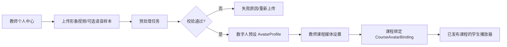

# 阶段8 附加模块：教师数字人资产中心 实施规划

> **路线状态（2026-08-06）**：本文描述的是后续“教师授权资产接入”扩展，不是当前
> 首版媒体/数字人验收主链。当前课程媒体固定使用平台预制 PixiJS 2D 角色
> 平台角色由 P5.1 注册表提供（当前默认 `platform-instructor-v2@1.0.0`）；学习端以发布 `audio-playlist/v1` 的音频时钟驱动角色。
> 教师真人视频、声音样本、DH_live/逐帧视频合成均不得作为当前课程 87 的发布前置。
> 本文中的旧接口、旧 Provider 名称和“上传后即可用于学生播放”的表述仅作历史设计
> 参考；真正接入必须新建版本化资产、授权/撤销记录并通过 MediaRelease 发布门。

> 本模块单独规划为"教师数字人身份与课程绑定"模块，**不把头像素材混在某门课程的课件上传里**。
> 教师先建立自己的数字人预设，再选择授权给哪些自己负责的课程使用。
>
> **实施状态**：M1 已落地，模型/服务/API/测试均按本文档同步。
> 实现位置：`backend/app/models/avatar_model.py`、`backend/app/services/avatar_service.py`、`backend/app/api/v1/endpoints/avatar.py`、`backend/tests/test_avatar.py`（41 个用例）。

## 当前边界（2026-08-06）

本模块不是当前课程媒体发布的前置链路。P4 首版已经冻结为平台预制 PixiJS 2D
平台注册角色（当前默认 `platform-instructor-v2@1.0.0`）+ `avatar-cues/v1`；课程 87 的验收先走 Fake WAV、
PPT manifest、`audio-playlist/v1` 和正式课程发布快照。教师上传真人视频/语音样本、
声音复刻和服务端逐帧数字人合成均属于后续扩展，不能在当前页面或文档中暗示“上传后
即可用于学生播放”。

本文后续的 AvatarProfile/AvatarAssetPackage 设计只有在下列条件全部满足后，才能
接入现行主链：明确授权与撤销记录、版本化资产包、独立 Provider POC、课程级
MediaRelease 绑定，以及学习端只消费签名 object key。旧的 DH_live、同步 Fake
`prepare/execute` 和教师素材上传描述保留作 M1 历史参考，不是当前实现完成证明。

## 教师看到的产品形态

个人中心新增"我的数字人"：

```text
我的数字人
- 新建数字人预设
- 上传形象视频
- 可选上传语音样本
- 查看预处理进度
- 预览效果
- 版本历史
- 停用 / 删除
```

预处理成功后，教师会得到一个可读的预设，例如：

```text
张老师 · 正面讲解 · 创建于 2026-07-26
引擎：DH_live-mini / provider-version
状态：可用
```

在教师的课程媒体设置页中，只显示其本人可用的预设：

```text
本课程讲解形象：
( ) 不使用数字人
( ) 张老师 · 正面讲解 · 2026-07-26
( ) 张老师 · 白板讲解 · 2026-08-03
```

教师选择后，不会立刻影响学生；应随课程媒体版本发布。

## 1. 总体流程



M1 已实现节点：A（`/avatar-profiles` API）、B（`/avatar-profiles/{id}/source-media` + `LocalStorageProvider`）、C（`/avatar-profiles/{id}/prepare` + `AvatarPreparationJob`）、F（`AvatarProfile` 状态机 ready）、G（`/courses/{id}/available-avatar-profiles`）、H（`/courses/{id}/media/avatar-binding` 状态机 draft→published→withdrawn/stale）。学生播放端 I 由 `/media/course/{id}/playback` 承载，前端渲染壳在 M3 实现。

## 2. 视频与音频的真实含义

上传时可接受：

- 必填：形象视频；
- 可选：清晰语音样本；
- 可选：教师选择的背景/透明抠像方式。

但必须明确区分：

| 文件 | 首版用途 | 是否意味着音色克隆 |
|---|---|---|
| 形象视频 | 提取数字人动作、脸部和网页渲染资产 | 否 |
| 视频自带音轨 | 预处理/口型对齐参考 | 否 |
| 独立语音样本 | 仅为未来音色方案保留，或用于质量检测 | 否，默认不克隆 |
| 课程讲稿音频 | 由科大讯飞 TTS 生成 | 否 |

也就是说，**首版不要因为教师上传了语音就自动做"声音复刻"**。科大讯飞 TTS 可先采用平台允许的标准音色；若未来要做教师音色克隆，需要单独的授权、服务能力、成本与撤销设计。

## 3. 后端数据模型

> 以下字段以 M1 落地的 `backend/app/models/avatar_model.py` 为准。

### `AvatarProfile`

教师拥有的逻辑数字人预设，按 `owner_user_id` 严格隔离。

```text
avatar_id              # avp_ 前缀
owner_user_id          # 外键 users.id
display_name           # 教师可读名称（1-100 字符）
status                 # AvatarProfileStatus 枚举
provider_key           # 当前 Provider，默认 fake
provider_version       # Provider 自报版本
current_asset_package_id  # 当前激活的 AvatarAssetPackage.asset_package_id
consent_text           # 授权确认文本快照（创建时必填，min_length=10）
consented_at           # 授权时间
default_render_mode    # 默认 browser_realtime
supported_quality_profiles  # 如 ['auto', 'low_resource']
notes                  # 教师备注
created_at / updated_at / deleted_at
```

状态（`AvatarProfileStatus`）：

```text
draft       # 教师刚创建，尚未上传素材
uploaded    # 已上传素材，待预处理
processing  # 预处理中
ready       # 预处理完成，可用于课程绑定
failed      # 预处理失败
disabled    # 教师主动停用（拒绝新预处理，已发布绑定标记 stale）
deleted     # 软删除（保留历史绑定，学生端走兼容模式）
```

### `AvatarSourceMedia`

原始上传文件的登记信息，仅存 `object_key`，不暴露绝对路径。

```text
source_media_id        # asm_ 前缀
avatar_id              # 关联 AvatarProfile.avatar_id
owner_user_id          # 外键 users.id
media_type             # portrait_video | voice_sample
object_key             # 抽象存储键，禁止暴露本地路径
content_sha256         # 内容哈希，用于去重
mime_type
duration_ms
size_bytes
upload_status          # pending | uploaded | validated | invalid | expired
retention_policy       # 保留策略标识
validation_notes       # 校验结果备注
created_at / validated_at
```

### `AvatarPreparationJob`

异步预处理任务，通过 `task_id` 关联统一任务中心，不重复实现状态机。

```text
job_id                 # apj_ 前缀
task_id                # 关联 task_service.TaskRecord.task_id
avatar_id
owner_user_id          # 外键 users.id
provider_key
provider_version
status                 # AvatarPreparationJobStatus 枚举
idempotency_key        # 客户端重试去重键（唯一约束 avatar_id + idempotency_key）
input_hash             # 输入素材哈希（唯一约束 avatar_id + input_hash）
input_summary          # 输入摘要字符串
input_payload          # JSON，如 portrait_object_key / voice_object_key
result_asset_package_id  # 成功后生成的 AvatarAssetPackage.asset_package_id
error_code             # 失败时保留原始错误码，禁止伪装成功
error_message_safe     # 安全的错误描述
attempt_count
created_at / started_at / finished_at
job_metadata           # JSON
```

状态（`AvatarPreparationJobStatus`，与 TaskRecord 状态镜像）：

```text
pending | running | succeeded | failed | cancelled | degraded
```

`degraded` 表示真实 Provider 不可用时回退 Fake 成功。

### `AvatarAssetPackage`

引擎可实际消费的产物。

```text
asset_package_id       # aap_ 前缀
avatar_id
owner_user_id          # 外键 users.id
provider_key
provider_version
object_prefix          # 资产在对象存储中的前缀
manifest_object_key    # manifest.json 的 object_key
asset_sha256
estimated_download_bytes
supported_render_modes  # 如 ['browser_realtime']
quality_profiles       # 如 ['auto', 'low_resource', 'compatibility']
status                 # AvatarAssetPackageStatus 枚举
created_at / finished_at
```

状态（`AvatarAssetPackageStatus`）：

```text
building  # 构建中
ready     # 可用
invalid   # 校验失败
stale     # 依赖资产失效（Provider 替换或预设删除后）
```

### `CourseAvatarBinding`

把教师的预设绑定到课程的已发布媒体版本。

```text
binding_id             # cab_ 前缀
course_id              # 外键 courses.id
avatar_id              # 关联 AvatarProfile.avatar_id
bound_by_user_id       # 外键 users.id
media_release_id       # 随该 MediaRelease 发布；未发布时为空
status                 # CourseAvatarBindingStatus 枚举
locked_provider_key    # 绑定时锁定，避免后续替换影响学生端
locked_provider_version
locked_asset_package_id
notes
created_at / published_at / withdrawn_at
binding_metadata       # JSON
```

状态（`CourseAvatarBindingStatus`）：

```text
draft      # 教师选定但未随版本发布
published  # 已随 MediaRelease 发布，学生可见
withdrawn  # 教师主动撤回
stale      # AvatarProfile 失效或资产包过期（学生端走兼容模式）
```

唯一约束：`(course_id, media_release_id)` —— 一条 MediaRelease 最多绑定一个预设。

首版严格限制：

```text
课程教师只能绑定自己 owner_user_id 的 AvatarProfile
```

以后若需要助教、联合授课教师共享形象，再引入显式授权表；不从全局教师角色推断。

## 4. 上传与预处理流程

```text
教师取得课程/个人空间权限
→ 创建 AvatarProfile 草稿
→ 服务端签发受限上传地址
→ 教师上传视频/可选音频
→ 后端校验文件
→ 创建 AvatarPreparationJob
→ 独立 Worker 预处理
→ 生成资产包与 manifest
→ 教师预览
→ 教师在自己的课程中选择并发布
```

上传校验至少包括：

- 文件类型白名单；
- 最大大小、时长、分辨率；
- 音视频可解码性；
- 是否存在音轨；
- 病毒/恶意文件扫描；
- 去重哈希；
- 明确的本人形象与授权确认勾选。

原始视频和数字人资产都存 `object_key`，不进 Git、不进入数据库字段中的绝对磁盘路径。

## 5. 接口规划

> 以下路径以 M1 落地的 `backend/app/api/v1/endpoints/avatar.py` 与 `media_release.py` 为准。
> 所有路径前缀为 `/api/v1`。

### 教师个人中心

```text
POST   /avatar-profiles                                          # 创建预设草稿（必填 consent_text）
GET    /avatar-profiles/me?include_deleted=false                 # 列出我的预设
GET    /avatar-profiles/{avatar_id}                              # 预设详情
POST   /avatar-profiles/{avatar_id}/source-media                 # 登记原始素材元数据（不接收文件流）
POST   /avatar-profiles/{avatar_id}/prepare                      # 创建预处理任务（202 + task_id）
POST   /avatar-profiles/{avatar_id}/prepare/execute              # M1 同步执行 Fake Provider
GET    /avatar-profiles/{avatar_id}/preparation-jobs             # 列出该预设的预处理任务
GET    /avatar-preparation-jobs/{job_id}                         # 预处理任务详情
POST   /avatar-profiles/{avatar_id}/disable                      # 停用（已发布绑定标记 stale）
DELETE /avatar-profiles/{avatar_id}                              # 软删除（保留历史绑定）
```

> **M1 简化点**：`source-media` 接口只登记 `object_key` 元数据，不签发上传地址。
> 文件上传由前端直接 PUT 到 `ObjectStorageProvider.sign_upload_intent` 签发的地址（M2 补齐独立端点）。
> `prepare/execute` 在 M1 阶段同步执行 Fake Provider 用于端到端测试；M4 接入真实引擎后将改为独立 Worker 异步执行。
> `preview` 端点预留至 M3 前端壳阶段实现。

### 课程媒体配置

```text
GET    /courses/{course_id}/available-avatar-profiles            # 列出当前教师可绑定的预设（仅 ready）
PUT    /courses/{course_id}/media/avatar-binding                 # 创建或更新草稿绑定（锁定 Provider/资产包）
GET    /courses/{course_id}/media/avatar-binding                 # 查询当前绑定
POST   /courses/{course_id}/media/avatar-binding/{binding_id}/publish   # 发布绑定（需指定 media_release_id）
POST   /courses/{course_id}/media/avatar-binding/{binding_id}/withdraw  # 撤回绑定（学生端走兼容模式）
```

权限要求：

- `available-avatar-profiles` / `PUT avatar-binding`：`course.media.generate`
- `GET avatar-binding`：`course.content.read`
- `publish` / `withdraw`：`course.publish`

### 学生播放端

学生不应获得"教师的所有预设"接口，只获得已发布课程媒体版本中的播放清单：

```text
GET    /media/course/{course_id}/playback                        # 统一播放清单
GET    /media/course/{course_id}/releases/current                # 当前 ACTIVE MediaRelease
```

返回课程已发布的：

- 音频 `audio_object_key`；
- 字幕（`subtitle_manifest_object_key`）；
- PPT 时间轴（`ppt_manifest_object_key` + `MediaTimelineCue`）；
- `DigitalHumanPlaybackManifest`（通过 `avatar_binding_id` 关联）；
- `default_playback_mode`（auto / low_resource / compatibility）。

## 6. 权限与隐私边界

- 教师只能管理自己的数字人预设；
- 课程教师只能在自己拥有课程管理权限的课程内绑定预设；
- 学生只能读取该课程已发布的渲染资产；
- 原始视频、语音样本不能直接给学生下载；
- 删除预设不应立即删掉已发布课程的历史版本，而是标记撤回并走媒体版本回滚；
- 教师可撤销授权，后续课程发布不能再选用该形象；
- 原始素材的保留期、删除与人工恢复规则需在实施前冻结。

## 7. 与可替换数字人引擎的关系

教师预设不应存为"DH_live 专属字段"。它只知道：

```text
这个教师的这个预设
→ 某 Provider
→ 某版本资产包
→ 可提供哪些播放模式
```

因此替换引擎时：

```text
旧 AvatarProfile
→ 新 Provider 重新生成一个 AvatarAssetPackage
→ 教师预览确认
→ 新建课程 MediaRelease
```

不会影响课程讲稿、TTS 音频、PPT Cue 或学生播放器主流程。

## 8. 实施顺序

> M1 已完成步骤 1-3 与 5-6 的后端部分；步骤 4、7、8 为后续批次。

1. ✅ 教师个人中心的预设列表、上传、状态展示（API + 服务层 + 测试）；
2. ✅ 数据表、上传校验、对象存储和预处理 Job（`AvatarSourceMedia` MIME/大小/SHA256 校验、`LocalStorageProvider`、`AvatarPreparationJob` 幂等）；
3. ✅ Fake DigitalHumanProvider，先验证完整状态机（`FakeDigitalHumanProvider` 生成占位资产包，41 个端到端测试覆盖）；
4. ⏳ 接入首个真实 Provider 的资产预处理（M4：`DhLiveMiniProvider` + Windows Worker）；
5. ✅ 教师预览和课程绑定（`CourseAvatarBinding` 草稿/发布/撤回状态机；`preview` 端点预留至 M3）；
6. ✅ 与 `MediaRelease`、PPT 时间轴、TTS 音频合并发布（绑定随 MediaRelease 发布，锁定 Provider/资产包版本）；
7. ⏳ 学生端三档播放与降级（M3：前端 `DigitalHumanRendererAdapter` + auto/low_resource/compatibility）；
8. ⏳ 删除、撤回、重新生成、Provider 替换演练（M5：已实现停用/删除标记 stale，Provider 替换演练待 M5）。

教师看到的是"我的数字人预设"，课程看到的是"本课程选用哪个预设"，学生看到的则始终只是"本课程当前已发布的讲解媒体"。
