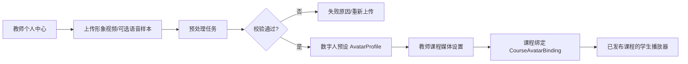

# 阶段8 附加模块：教师数字人资产中心 实施规划

> 本模块单独规划为"教师数字人身份与课程绑定"模块，**不把头像素材混在某门课程的课件上传里**。
> 教师先建立自己的数字人预设，再选择授权给哪些自己负责的课程使用。

## 教师看到的产品形态

个人中心新增"我的数字人"：

```text
我的数字人
- 新建数字人预设
- 上传形象视频
- 可选上传语音样本
- 查看预处理进度
- 预览效果
- 版本历史
- 停用 / 删除
```

预处理成功后，教师会得到一个可读的预设，例如：

```text
张老师 · 正面讲解 · 创建于 2026-07-26
引擎：DH_live-mini / provider-version
状态：可用
```

在教师的课程媒体设置页中，只显示其本人可用的预设：

```text
本课程讲解形象：
( ) 不使用数字人
( ) 张老师 · 正面讲解 · 2026-07-26
( ) 张老师 · 白板讲解 · 2026-08-03
```

教师选择后，不会立刻影响学生；应随课程媒体版本发布。

## 1. 总体流程



## 2. 视频与音频的真实含义

上传时可接受：

- 必填：形象视频；
- 可选：清晰语音样本；
- 可选：教师选择的背景/透明抠像方式。

但必须明确区分：

| 文件 | 首版用途 | 是否意味着音色克隆 |
|---|---|---|
| 形象视频 | 提取数字人动作、脸部和网页渲染资产 | 否 |
| 视频自带音轨 | 预处理/口型对齐参考 | 否 |
| 独立语音样本 | 仅为未来音色方案保留，或用于质量检测 | 否，默认不克隆 |
| 课程讲稿音频 | 由科大讯飞 TTS 生成 | 否 |

也就是说，**首版不要因为教师上传了语音就自动做"声音复刻"**。科大讯飞 TTS 可先采用平台允许的标准音色；若未来要做教师音色克隆，需要单独的授权、服务能力、成本与撤销设计。

## 3. 后端数据模型

### `AvatarProfile`

教师拥有的逻辑数字人预设。

```text
avatar_id
owner_user_id
display_name
status
provider_key
provider_version
current_asset_package_id
created_at
updated_at
```

状态：

```text
draft
uploaded
processing
ready
failed
disabled
deleted
```

### `AvatarSourceMedia`

原始上传文件的登记信息。

```text
source_media_id
avatar_id
media_type = portrait_video | voice_sample
object_key
content_sha256
mime_type
duration_ms
size_bytes
upload_status
retention_policy
```

### `AvatarPreparationJob`

异步预处理任务，不能放在主 Web 请求里。

```text
job_id
avatar_id
provider_key
provider_version
status
input_hash
result_asset_package_id
error_code
error_message_safe
attempt_count
created_at
finished_at
```

### `AvatarAssetPackage`

引擎可实际消费的产物。

```text
asset_package_id
avatar_id
provider_key
provider_version
object_prefix
manifest_object_key
asset_sha256
estimated_download_bytes
supported_render_modes
quality_profiles
status
```

### `CourseAvatarBinding`

把教师的预设绑定到课程的已发布媒体版本。

```text
binding_id
course_id
avatar_id
bound_by_user_id
media_release_id
status = draft | published | withdrawn | stale
published_at
```

首版严格限制：

```text
课程教师只能绑定自己 owner_user_id 的 AvatarProfile
```

以后若需要助教、联合授课教师共享形象，再引入显式授权表；不从全局教师角色推断。

## 4. 上传与预处理流程

```text
教师取得课程/个人空间权限
→ 创建 AvatarProfile 草稿
→ 服务端签发受限上传地址
→ 教师上传视频/可选音频
→ 后端校验文件
→ 创建 AvatarPreparationJob
→ 独立 Worker 预处理
→ 生成资产包与 manifest
→ 教师预览
→ 教师在自己的课程中选择并发布
```

上传校验至少包括：

- 文件类型白名单；
- 最大大小、时长、分辨率；
- 音视频可解码性；
- 是否存在音轨；
- 病毒/恶意文件扫描；
- 去重哈希；
- 明确的本人形象与授权确认勾选。

原始视频和数字人资产都存 `object_key`，不进 Git、不进入数据库字段中的绝对磁盘路径。

## 5. 接口规划

### 教师个人中心

```text
POST   /v1/avatar-profiles
GET    /v1/avatar-profiles/me
GET    /v1/avatar-profiles/{avatar_id}
POST   /v1/avatar-profiles/{avatar_id}/source-media/upload-intent
POST   /v1/avatar-profiles/{avatar_id}/prepare
GET    /v1/avatar-preparation-jobs/{job_id}
POST   /v1/avatar-profiles/{avatar_id}/preview
POST   /v1/avatar-profiles/{avatar_id}/disable
DELETE /v1/avatar-profiles/{avatar_id}
```

### 课程媒体配置

```text
GET    /v1/courses/{course_id}/available-avatar-profiles
PUT    /v1/courses/{course_id}/media/avatar-binding
GET    /v1/courses/{course_id}/media/avatar-binding
POST   /v1/courses/{course_id}/media/avatar-binding/publish
POST   /v1/courses/{course_id}/media/avatar-binding/withdraw
```

### 学生播放端

学生不应获得"教师的所有预设"接口，只获得已发布课程媒体版本中的播放清单：

```text
GET /v1/courses/{course_id}/media-release/current
```

返回课程已发布的：

- 音频；
- 字幕；
- PPT 时间轴；
- `DigitalHumanPlaybackManifest`；
- 自动/低资源/兼容模式配置。

## 6. 权限与隐私边界

- 教师只能管理自己的数字人预设；
- 课程教师只能在自己拥有课程管理权限的课程内绑定预设；
- 学生只能读取该课程已发布的渲染资产；
- 原始视频、语音样本不能直接给学生下载；
- 删除预设不应立即删掉已发布课程的历史版本，而是标记撤回并走媒体版本回滚；
- 教师可撤销授权，后续课程发布不能再选用该形象；
- 原始素材的保留期、删除与人工恢复规则需在实施前冻结。

## 7. 与可替换数字人引擎的关系

教师预设不应存为"DH_live 专属字段"。它只知道：

```text
这个教师的这个预设
→ 某 Provider
→ 某版本资产包
→ 可提供哪些播放模式
```

因此替换引擎时：

```text
旧 AvatarProfile
→ 新 Provider 重新生成一个 AvatarAssetPackage
→ 教师预览确认
→ 新建课程 MediaRelease
```

不会影响课程讲稿、TTS 音频、PPT Cue 或学生播放器主流程。

## 8. 实施顺序

1. 教师个人中心的预设列表、上传、状态展示；
2. 数据表、上传校验、对象存储和预处理 Job；
3. Fake DigitalHumanProvider，先验证完整状态机；
4. 接入首个真实 Provider 的资产预处理；
5. 教师预览和课程绑定；
6. 与 `MediaRelease`、PPT 时间轴、TTS 音频合并发布；
7. 学生端三档播放与降级；
8. 删除、撤回、重新生成、Provider 替换演练。

教师看到的是"我的数字人预设"，课程看到的是"本课程选用哪个预设"，学生看到的则始终只是"本课程当前已发布的讲解媒体"。
