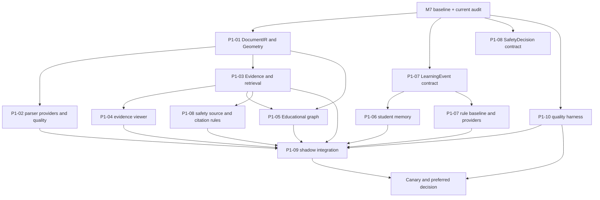

# 产品一多 Coding Agent 并行开发任务分配方案

更新时间：2026-07-13
规划基线：`feature/r2d-document-ir@d1eea62`
决赛维护基线：`refactor/codemind-v3@3895002`，tag `m7-baseline-20260713`
性质：只读审计后的开发编排方案，不代表所列未来能力已经实现。

## 0. 规划结论

推荐组织为 **1 个主协调 Agent + 10 个执行 Agent**。不采用“一个 Agent 承包一个大模块并直接修改全仓库”的方式。

原工作流 A 拆成“Document IR 核心”和“解析 Provider/质量路由”两个执行单元。原因是 DocumentIR 是所有证据、检索、图谱和前端高亮的基础契约，不能与 Docling、PPTX、OCR 等易变实现绑在同一个变更集中。

工作流 H 保留为唯一集成 Owner，同时独占 ORM、Migration、公开 API、公共配置、`document.py`、`document_service.py`、前端路由与公共 request。工作流 I 保留为独立质量门禁 Owner，不能由各业务 Agent 自己宣布通过。

工作流 F 分两步：先实现 `LearningEvent/LearningEvidence` 和规则基线，再只定义 BKT、IRT、DeepKnowledgeTracing Provider 接口。任何算法实现必须等待事件质量、金标和解释契约通过；当前阶段不得把 BKT/HMM/LSTM/DKT 描述为已完成。

## 1. 审计范围与证据口径

本方案实际核对了：

- 产品说明：`docs/产品一-泛雅AI互动智课平台.md`。
- R2D 全部设计：`docs/refactor/document_kg_v2/`。
- 基线报告：`docs/phase1/M4A执行报告.md`、`M4B执行报告.md`、`M4C缺陷修复报告.md`、`M7*.md`、`docs/refactor/R1*.md`、`R2B数字人与PPT任务迁移报告.md`、`R2C-TTS批量任务迁移报告.md`。
- 真实后端：`backend/app/main.py`、路由、Service、SQLModel、Adapter、TaskRunner、RAG、配置、启动和部署文件。
- 真实前端：`frontend/src/router/index.js`、`frontend/src/utils/request.js`、教师端、学生端、播放器、问答、进度、映射组件与 API。
- 测试：M4A/M4B/M7、R1、R2B、R2C、课程范围检索与 RetrievalGateway 测试。
- Git：当前分支、远端跟踪、stash、未提交文件与最近提交。

状态口径：

| 状态 | 判定标准 |
|---|---|
| 已实现并有代码和测试 | 注册路由或真实调用链存在，且有对应自动化证据 |
| 已有接口但效果未验收 | 调用链存在，但测试使用 fake，或缺少真实质量/环境验收 |
| 仅有设计 | 文档定义了契约或路线，生产包中没有对应实现 |
| 完全未实现 | 未发现路由、Service、Model、Provider 或有效测试 |
| 高风险技术债 | 已运行但有共享状态、超大文件、重复实现、权限或迁移风险 |

本轮没有重新运行测试。下文测试数字引用现有执行报告，不能当作 2026-07-13 本轮新执行结果。

## 2. 当前架构审计摘要

### 2.1 已有能力

| 能力 | 状态 | 代码/测试证据 | 结论边界 |
|---|---|---|---|
| 教师上传、课程、脚本、映射、发布 | 已实现并有流程测试 | `document.py::upload_document/save_course_nodes/publish_course`；`mapping.py`；`test_m4b_main_flows.py` | M4B/M7 fake 解析，不证明真实解析质量 |
| 学生选课、播放器、进度、问答、测验、前置跳转 | 已实现并有流程测试 | `document.py::enroll_course`；`player.py`；`progress.py`；`chat.py`；`prerequisite.py`；M4B/M7 | 前置历史测试仍有技术债；学情不是统一事件模型 |
| 外部服务适配 | 已实现并有适配器测试 | `backend/app/platform/adapters/`；`test_r1_adapters.py`；`test_r1_adapter_migration.py` | fake 证明错误分类，不证明真实服务质量 |
| 轻量长任务语义 | 已实现并有测试 | `backend/app/platform/tasks/`；R2B/R2C 测试 | 仅进程内结果归一化，无持久任务恢复 |
| 课程范围检索网关 | 已实现并有测试 | `platform/retrieval/`；`test_retrieval_gateway.py`；`test_rag_course_scope.py` | 仍为内存树；无持久 Evidence、BM25、向量和 reranker |
| 现有知识点/关系 CRUD | 部分实现 | `KnowledgePoint`、`KnowledgeRelation`、`knowledge.py`、`knowledge_service.py` | 自由字符串关系；无证据、快照、本体和自动构建 |
| 理解度与前置跳转记录 | 已有接口但效果未验收 | `UnderstandingAnalysis`、`LearningJumpHistory`、`progress_service.py`、`prerequisite_service.py` | 由 prompt/规则直接产出，不是统一 LearningEvidence 驱动 |
| 泛雅接口 | 已有接口但效果未验收 | `platform.py::sso_callback/sync_user/sync_course/sync_enrollment/callback_progress` | 未在真实泛雅环境端到端验收 |
| 数字人/PPT/TTS | 已有接口但真实效果未验收 | R1/R2B/R2C；`VideoGenerationTask`；`tts_generation_status` | Duix 仍为 `WAITING_FOR_HARDWARE`；自动化均为 fake |

### 2.2 可复用能力

1. `Course/CourseScript/ScriptNode/KnowledgePageMap` 可作为 V1 兼容投影目标。
2. `RetrievalScope/RetrievedChunk/RetrievalGateway` 可作为 V2 检索入口，但 `RetrievedChunk.chunk_id` 明确只是过渡树节点 ID，不能冒充 DocumentIR block/evidence ID。
3. R1 `AdapterResult/AdapterErrorCode` 与 R2 `TaskResult/TaskStatus` 可继续承载外部失败和长任务结果。
4. `backend/tests/conftest.py` 的临时 SQLite、网络阻断、dependency override，以及 `fakes.py` 的五类模式可继续复用。
5. `common/ppt_parser.py::PPTParser`、Docling、LibreOffice/PDF 渲染和 mapping 的页文本提取可包装为 Provider，不能直接成为 canonical schema。
6. M7 演示数据、预检和 fallback 是所有新能力的回归底线。

### 2.3 主要技术债与危险共享模块

| 模块 | 事实 | 危险性 |
|---|---|---|
| `backend/app/api/v1/endpoints/document.py` | 约 2768 行，含上传、课程、脚本、发布、选课、统计、幻灯片、TTS；还存在重复 `/courses` 和 `/course/{id}/save` 路由 | 多 Agent 同改会直接造成路由顺序、响应和 M7 回归 |
| `backend/app/services/document_service.py` | 约 2072 行，解析、Markdown 重建、LLM 脚本、RAG 编排集中 | 解析 Provider 与业务编排耦合；不能多人并发拆改 |
| `frontend/src/views/TeacherDashboard.vue` | 约 2400 行 | 教师端所有新入口易冲突 |
| `frontend/src/utils/request.js` | 鉴权、签名、统一响应解包集中 | 任何修改影响全前端 API |
| `backend/app/models/database.py` | 导入所有 ORM 并创建全局 engine | 新模型、测试导入、循环依赖和初始化风险集中 |
| `backend/app/common/db_migrator.py` | 直接固定 `database/smart_class.db`，不是版本化 migration 系统 | 与 `AI_COURSE_DATABASE_URL` 不一致；不可作为 V2 大规模迁移机制 |
| RAG 全局兼容层 | `rag_pipeline` 和 Registry 为进程内单例；无 scope 路径仍保留最后一棵树兼容行为 | 重启、多 worker、遗留调用和索引版本风险 |
| 前端播放器 | `SplitVideoPlayer.vue` 约 900 行，按页图/节点范围展示 | 引用高亮若直接塞入该文件会形成第二个共享热点 |

### 2.4 阻塞并行开发的契约缺失

1. 稳定 `DocumentIR/Geometry/Provenance` 尚无代码实现。
2. `EvidenceSpan/EvidenceBundle/TextTransformMap/ChunkSegment` 尚无代码实现。
3. `RetrievedChunk` 尚未绑定 stable source/version/block/evidence；外部 `ragSources` 仍是旧结构。
4. 没有 Citation Key、Citation Validator、拒答结果和引用失效语义。
5. 没有 `EducationalUnit/GraphEvidence/GraphSnapshot` 代码契约。
6. 没有统一 `LearningEvent/LearningEvidence`，现有进度、测验、问答和跳转不能稳定汇聚。
7. 没有可删除、可审计、按学生和课程隔离的 `StudentMemory`。
8. 没有 `SafetyDecision` 及输入、来源、输出三阶段策略接口。
9. 没有 V2 公开 DTO 的兼容规则和数据库迁移执行机制。

### 2.5 文档与代码不一致

1. `R2D0当前文档与图谱链路审计.md` 中“问答无课程隔离”已被提交 `622e3f1` 的 `RetrievalScope/RetrievalGateway` 修复；但持久索引、Evidence 和多文档仍未实现。
2. `R2D0-P1A统一Retriever接口与知识作用域建模.md` 写有“未 commit/push”，实际代码已在 `622e3f1`，且当前相关分支均包含该提交。
3. `M4B执行报告.md` 记录的首次选课、`my-courses` 路由和数字人业务失败缺陷，已由 `M4C缺陷修复报告.md` 和当前代码修复。M4B 仍应作为发现历史，不作为当前缺陷清单。
4. `R2C-TTS批量任务迁移报告.md` 的“尚未提交”回滚描述已过时；补齐提交 `1598abb` 已存在。
5. `deploy/docker-compose.yml` 含 PostgreSQL/Neo4j，但当前 `database.py` 默认事实是 SQLite `database/smart_class.db`；compose 不能作为生产已迁移证据。
6. `schemas/cognitive.py`、`schemas/graphrag.py`、`schemas/agent.py` 和对应 endpoint 只有注释，且未在 `main.py` 注册；前端 cognitive/graphrag/agent 组件也多为占位。
7. `document_new.py` 及 `document_upload.py/document_course.py/document_tts.py/...` 是未完成拆分旁路，`main.py` 仍注册 `document.py`。

## 3. 工作流与 Agent 划分

### Agent P1-00

Agent 编号：P1-00
Agent 名称：主协调与契约治理
职责目标：冻结跨域术语、版本规则、ADR、合流顺序和 M7 兼容边界，不承包业务实现。
负责目录和文件：`docs/refactor/product1/contracts/`、`docs/refactor/product1/adr/`、本方案及契约清单。
允许修改：契约登记、ADR、合流清单、验收报告。
禁止修改：生产代码、ORM、Migration、公开 API、前端共享文件、业务 Agent 私有目录。
依赖的上游契约：M7 基线、AGENTS.md、产品一事实依赖。
向下游提供的契约：版本规则、变更申请模板、冻结 SHA、合流顺序。
具体任务：建立 contract registry；审批 stable ID、scope、删除和审计语义；主持契约 review；阻止循环依赖和越权改文件。
测试要求：检查 JSON Schema 示例、向后兼容清单和跨 Agent contract test 结果；不自行替业务 Agent 宣布质量通过。
验收标准：每个公共契约有唯一 Owner、版本、消费者、破坏性变更判定和回滚说明。
主要风险：协调 Agent 越权直接修业务，导致 Owner 模糊。
预计冲突文件：规划/ADR 文档。
合流负责人：P1-00。

### Agent P1-01

Agent 编号：P1-01
Agent 名称：Document IR 核心
职责目标：实现稳定源文件身份、Canonical DocumentIR、Geometry、Provenance、序列化和 shadow artifact，不接公开上传主链。
负责目录和文件：新增 `backend/app/platform/document_intelligence/contracts.py`、`source_artifact.py`、`document_ir/`、`persistence/json_artifact_store.py`；`backend/tests/document_intelligence/test_*contract*.py`。
允许修改：上述新增模块和专属测试。
禁止修改：`document.py`、`document_service.py`、ORM、Migration、`main.py`、配置、requirements、前端。
依赖的上游契约：R2D0 DocumentIR 设计；稳定 ID 和 schema version 决议。
向下游提供的契约：`SourceArtifact`、`DocumentIR`、`DocumentUnit`、block union、`Geometry/Polygon`、`ParserRun/Provenance/QualityReport`。
具体任务：实现 stable/execution ID 分离；bbox/polygon/字符范围校验；阅读顺序；block 引用完整性；JSON round-trip；未知 major 拒绝；原子 shadow store；V1 adapter 仅映射已知文本/页并产生缺失 warning。
测试要求：稳定 ID、schema major、引用完整性、坐标边界、路径穿越、checksum、重复写、并发原子性、五类 fake 失败和 partial。
验收标准：相同 fixture 生成字节级可比较 IR；不存在孤立 block 引用；默认 V1 行为零变化。
主要风险：过早把 Provider 私有字段固化为 canonical 字段。
预计冲突文件：`document_intelligence/__init__.py`，由 P1-01 独占。
合流负责人：P1-00 review，P1-09 接线。

### Agent P1-02

Agent 编号：P1-02
Agent 名称：解析 Provider 与质量路由
职责目标：把现有 Docling、python-pptx、后续 PaddleOCR 包装为可替换 Provider，产出 P1-01 的 DocumentIR，并建立质量路由。
负责目录和文件：`backend/app/platform/document_intelligence/providers/`、`probe.py`、`registry.py`、`planner.py`、`quality.py`、`reconciliation.py`；专属 parser fixtures/tests。
允许修改：新 Provider、冻结 fixture、离线 benchmark runner。
禁止修改：现有 `DocumentParser`、`PPTParser`、上传 endpoint、ORM、requirements；未经审批不得安装 PaddleOCR/Docling 新版本。
依赖的上游契约：P1-01 `DocumentIR/Geometry/ParserRun`。
向下游提供的契约：`ParserProvider/ParserRegistry/ParsePlan/ProbeResult/QualityDecision`。
具体任务：先做 V1 adapter 和 native PPTX provider；再做 Docling provider；对 OCR 只定义能力和 fake，真实 PaddleOCR 实现需独立依赖/硬件审批；实现 quality failure 与 runtime failure 区分、fallback reason 和 needs_review。
测试要求：PPTX/PDF/DOCX、损坏/加密/不支持、图片型页、表格/备注/阅读顺序、timeout/unavailable/malformed/business failure/partial；全离线。
验收标准：Provider 输出只经 P1-01 contract；低质量结构不能伪装 success；同源 raw/provenance 可回放。
主要风险：坐标原点、单位和页尺寸不一致；OCR 依赖过重。
预计冲突文件：只读 `document_service.py`、`common/ppt_parser.py`；不得直接修改。
合流负责人：P1-01 验证契约，P1-09 接 shadow。

### Agent P1-03

Agent 编号：P1-03
Agent 名称：Evidence 与课程范围混合检索
职责目标：建立从 DocumentIR block 到检索、重排、生成和引用的证据身份链，保持现有 `ragSources` 增量兼容。
负责目录和文件：`backend/app/platform/evidence/`、`backend/app/platform/retrieval/`、新 BM25/vector/rerank Provider 目录、专属 tests。
允许修改：Evidence contract、RetrievalGateway 内部接口、Provider 和兼容 mapper。
禁止修改：`qa_service.py`、`chat.py`、ORM/Migration、公开 API、前端；这些由 P1-09 接线。
依赖的上游契约：P1-01 stable artifact/document/block/geometry；P1-09 scope/visibility 决议。
向下游提供的契约：`EvidenceSpan/EvidenceBundle/TextTransformMap/ChunkSegment/SemanticChunk/RetrievedChunk/Citation/CitationValidationResult`。
具体任务：保留原文字符映射；多文档 source/version/status；课程与文档 scope；BM25 与向量 Provider；RRF/重排；Evidence ID 全链保留；Citation Key/Validator；无证据拒答结果；V1 tree fallback。
测试要求：跨课程/文档隔离、同 ID 不同 scope、版本变化、Evidence ID 丢失、引用不支持答案、索引重启、BM25/vector fake、reranker business failure、V1 fallback。
验收标准：每个可展示引用可解析到稳定 evidence 和 block；无证据时不能伪造 citation；无评测不得宣称提升。
主要风险：提前公开不稳定 source/evidence 字段；向量模型和索引绑定。
预计冲突文件：现有 `retrieval/schemas.py/gateway.py`，仅 P1-03 可改。
合流负责人：P1-00 契约 review，P1-09 QA 接线。

### Agent P1-04

Agent 编号：P1-04
Agent 名称：原文查看器与坐标高亮
职责目标：以独立前端组件实现引用卡片、文档页跳转和多区域高亮，不把实现塞入现有大播放器。
负责目录和文件：新增 `frontend/src/features/evidence-viewer/`、专属 `frontend/src/api/evidence.js`、组件测试和坐标金标 fixture。
允许修改：新 feature 目录、新 API 模块、专属测试/Story 页面。
禁止修改：`router/index.js`、`utils/request.js`、`SplitVideoPlayer.vue`、`StudentDashboard.vue`、`TeacherDashboard.vue`；接线由 P1-09 完成。
依赖的上游契约：P1-01 `Geometry`；P1-03 `Citation/EvidenceSpan`；P1-09 文档资源 API。
向下游提供的契约：`EvidenceViewerProps`、`HighlightOverlayModel`、引用点击事件和失效提示事件。
具体任务：优先 PDF/渲染页图统一视图；PPT/DOCX 通过服务端冻结渲染页；实现 normalized coordinates 到屏幕坐标、缩放/旋转、多 polygon、近似定位、版本失效和无坐标降级。
测试要求：不同 viewport/缩放/旋转、多个区域、越界 polygon、版本冲突、引用失效、键盘可访问、移动端；不得依赖真实后端。
验收标准：金标坐标误差在预先批准阈值内；引用点击可定位；失效不静默高亮错误位置。
主要风险：PDF/PPT/DOCX 三套渲染坐标混用；图片 natural size 与 CSS size漂移。
预计冲突文件：最终挂载点由 P1-09 独占。
合流负责人：P1-09 前后端联调。

### Agent P1-05

Agent 编号：P1-05
Agent 名称：教育知识结构与证据图谱
职责目标：从 Evidence 支撑的 EducationalUnit 生成可校验候选、教师审核和不可变图快照；图谱不作为可追溯 RAG 的前置。
负责目录和文件：新增 `backend/app/domain/education_graph/`、`backend/app/platform/graph/`、专属 schema/fixture/tests。
允许修改：本体、候选提取接口、归一化、校验、GraphStore Protocol、内存/JSON fake store。
禁止修改：现有 `KnowledgePoint/KnowledgeRelation` ORM、knowledge endpoint、Neo4j compose、Migration、QA 主链。
依赖的上游契约：P1-01 DocumentIR；P1-03 Evidence；P1-00 ontology version 规则。
向下游提供的契约：`EducationalUnit`、图节点/边候选、`GraphEvidence`、`GraphReviewDecision`、`GraphSnapshot`、受控图扩展结果。
具体任务：确定性 Course/Chapter/Section/Page/SourceBlock；schema 约束实体关系候选；canonical key/alias；类型矩阵、自环/环/孤点校验；accepted 必有 Evidence；教师 review 状态机；GraphStore SQL 设计建议交 P1-09。
测试要求：实体/关系/evidence 金标、同义词、错误方向、先修环、无证据边拒绝、malformed/business failure、snapshot 不可变与回滚。
验收标准：任何 accepted 节点/边可回溯 Evidence；图失败不影响文档检索；GraphRAG/Neo4j 仅在后续对照试验。
主要风险：LLM 候选被误当最终事实；图谱与 `KnowledgeRelation` 双事实源。
预计冲突文件：ORM/knowledge API 只提交设计建议，不直接改。
合流负责人：P1-09 存储/API，P1-00 本体审批。

### Agent P1-06

Agent 编号：P1-06
Agent 名称：学生专属记忆与隐私控制
职责目标：实现来源明确、课程隔离、可查看/修正/删除/关闭的学生记忆领域层，并以只读/Shadow 上下文注入接入问答。
负责目录和文件：新增 `backend/app/domain/student_memory/`、`frontend/src/features/student-memory/`、专属 tests。
允许修改：记忆领域模型、Repository Protocol、MemoryPolicy、上下文选择器、新前端 feature。
禁止修改：ORM/Migration、`qa_service.py`、`chat.py`、router/request、现有用户模型；由 P1-09 接线。
依赖的上游契约：P1-07 `LearningEvent/LearningEvidence/MasteryState`；身份与课程权限决议。
向下游提供的契约：`StudentProfile/CourseMemory/MemoryEntry/TeachingStrategy/MemoryAuditRecord/MemoryContext`。
具体任务：定义显式来源、置信、生命周期、过期、用户纠正、软删/硬删策略；跨课程禁止复用默认；注入 token 预算；关闭记忆后不读不写；删除传播清单。
测试要求：跨学生/课程/教师越权、删除后不可检索、审计保留边界、关闭开关、过期、冲突纠正、prompt 注入隔离、并发更新。
验收标准：每条记忆有 evidence refs 和可解释生成原因；用户操作可验证；无聊天自由总结直接入长期记忆。
主要风险：隐私越权、删除不彻底、错误记忆自我强化。
预计冲突文件：前后端挂载点由 P1-09 独占。
合流负责人：P1-09 权限/API，P1-10 安全测试。

### Agent P1-07

Agent 编号：P1-07
Agent 名称：学习事件与认知分析
职责目标：先把现有进度、测验、问答、提示和跳转映射为统一事实事件，再形成可解释学习证据和规则基线。
负责目录和文件：新增 `backend/app/domain/learning/`、`backend/app/platform/mastery/`、专属 tests/离线评测。
允许修改：事件、证据、规则引擎、Provider Protocol、离线 evaluator。
禁止修改：现有 progress/prerequisite endpoint/service、ORM/Migration、前端报表共享页；由 P1-09 接线。
依赖的上游契约：课程/学生/知识点身份；P1-05 EducationalUnit 可选映射。
向下游提供的契约：`LearningEvent/LearningEvidence/MasteryState/MisconceptionState/Recommendation/MasteryProviderResult`。
具体任务：事件幂等键、来源和时间语义；现有数据兼容 mapper；evidence 聚合；RuleBased baseline；BKT/IRT/DKT 仅定义 Provider 接口与能力声明；个人/班级报告 DTO 建议交 P1-09。
测试要求：重复/乱序/缺失事件、跨学生/课程、删除/更正、证据解释、规则 baseline 金标、Provider timeout/malformed/business failure、算法离线指标可复现。
验收标准：任何 mastery/recommendation 可列出 LearningEvidence；无 evidence 不生成强结论；高级模型不能绕过统一结果契约。
主要风险：把 prompt 推断当测量事实；事件定义频繁变化导致全链重算。
预计冲突文件：现有 progress/prerequisite 只读，不直接改。
合流负责人：P1-09 数据接入，P1-10 评测门禁。

### Agent P1-08

Agent 编号：P1-08
Agent 名称：教师安全策略与审计
职责目标：建立平台默认策略、课程级教师规则、来源权限、输入/输出决策和审计，不把安全逻辑散落进 prompt。
负责目录和文件：新增 `backend/app/domain/safety/`、`frontend/src/features/safety-policy/`、专属 tests。
允许修改：Policy contract、规则编译/校验、SafetyEvaluator、AuditSink Protocol、新前端 feature。
禁止修改：中间件、`chat.py`、`qa_service.py`、ORM/Migration、router/request；由 P1-09 接线。
依赖的上游契约：P1-03 Citation；角色/课程权限；AI 生成标识规则。
向下游提供的契约：`SafetyPolicy/SafetyDecision/SourceAccessDecision/AuditEvent`。
具体任务：平台规则与课程规则优先级；关键词/正则安全校验和 ReDoS 防护；禁答/限答/必须引用/禁止直接给作业答案；来源白名单；输出审查；审计去敏。
测试要求：规则冲突、regex 超时、越权来源、必须引用但无证据、prompt injection、审计脱敏、关闭课程规则仍保留平台底线。
验收标准：每次阻断/限答有稳定 reason code；策略失败 fail-closed；日志不含 token/密钥/完整敏感内容。
主要风险：过度拦截影响教学；正则拒绝服务；教师规则突破平台底线。
预计冲突文件：公开配置与 QA hook 由 P1-09 独占。
合流负责人：P1-09 接入，P1-10 安全门禁。

### Agent P1-09

Agent 编号：P1-09
Agent 名称：兼容接入、公开 API 与数据迁移
职责目标：作为唯一共享文件 Owner，把已验收模块通过 Feature Flag/Shadow/V1 fallback 接入真实上传、问答、播放器和课程主链。
负责目录和文件：`backend/app/main.py`、`core/config.py`、`models/`、migration、公开 schemas/endpoints/services 接线、`document.py`、`document_service.py`、`qa_service.py`、`chat.py`、`progress_service.py`、前端 router/request 和现有挂载页。
允许修改：仅按已批准契约做最小兼容接线、模型/Migration、公开 DTO 和 feature flag。
禁止修改：各 Agent 私有算法/Provider；未经 P1-00/P1-10 通过不得接 preferred；不得改 M7 基线分支。
依赖的上游契约：P1-01 至 P1-08 全部已冻结 contract 和 contract tests。
向下游提供的契约：向后兼容 API、Repository 实现、Migration、Feature Flag、Shadow telemetry、V1/V2 projection/fallback。
具体任务：先 shadow，不写 V1 表；设计可回滚 migration；新增 endpoint 采用独立 router；旧响应字段不删改；Evidence/Citation 仅增量字段；统一权限；挂载前端 feature；记录 fallback reason；控制配置 fail-closed。
测试要求：M7 全链、M4A/M4B/R1/R2 回归、Migration 空库/旧库/回滚、V1/V2 shadow diff、公开 OpenAPI snapshot、前后端 contract、权限、fallback。
验收标准：默认 `v1_only`；关闭全部新 flag 后与 M7 基线等价；Migration 可在授权副本回滚；公开路径和原字段兼容。
主要风险：共享文件集中导致变更过大；Migration 误伤 V1；前后端契约漂移。
预计冲突文件：所有核心共享文件，仅 P1-09 可改。
合流负责人：P1-00 最终审批，P1-10 独立门禁。

### Agent P1-10

Agent 编号：P1-10
Agent 名称：测试、评测与发布门禁
职责目标：独立维护公共 fake、金标、contract 测试、跨域集成矩阵和发布门禁，防止“只测 fake 就宣称质量”。
负责目录和文件：`backend/tests/fakes.py`、公共 `conftest.py`、`backend/tests/product1/`、`frontend` 新 E2E/contract 测试、`tests/benchmarks/product1/`、质量报告。
允许修改：测试基础设施、离线 fixture、评测 runner、门禁脚本；对业务缺陷提交复现，不直接修生产代码。
禁止修改：生产业务、ORM/Migration、公开 API、删除/skip/弱化断言、真实付费请求。
依赖的上游契约：所有冻结契约和各 Agent 独立交付。
向下游提供的契约：质量门禁结果、回归矩阵、基线 JSON、缺陷复现和 canary 准入结论。
具体任务：扩展 Parser/Retriever/Mastery/Safety fake；解析和高亮金标；RAG citation/no-answer 集；记忆权限删除；事件/规则 baseline；Migration/rollback；M7 smoke；生成 machine-readable 报告。
测试要求：覆盖本方案第 8 节全部场景；网络阻断、临时 DB/目录；真实小样本只用自建或许可 fixture；模型质量与 fake 控制流分开报告。
验收标准：业务 Agent 无法自行绕过门禁；失败和限制完整记录；新失败数不扩大，或有可复现归因和人工批准。
主要风险：金标质量不足；测试与实现共同犯错；基准污染。
预计冲突文件：`conftest.py/fakes.py` 仅 P1-10 可改；业务 Agent 提交扩展需求。
合流负责人：P1-10 出具结论，P1-00 决定合流。

## 4. 文件所有权矩阵

| 目录或文件 | 唯一 Owner Agent | 可读取 Agent | 禁止直接修改 Agent | 共享修改流程 |
|---|---|---|---|---|
| `backend/app/main.py` | P1-09 | 全部 | P1-01..08、P1-10 | 提交接线说明/patch proposal，由 P1-09 实施 |
| `backend/app/core/config.py`、`.env.example` | P1-09 | 全部 | 其他全部 | ADR 批准 flag 名和默认值后由 P1-09 修改 |
| `backend/app/models/*.py`、`models/database.py` | P1-09 | 全部 | 其他全部 | 领域 Agent 提交逻辑 schema；P1-09 统一 ORM 实现 |
| Migration/`db_migrator.py` | P1-09 | P1-00、P1-10 | 其他全部 | 必须独立 PR、旧库副本测试、down/逻辑回滚方案 |
| 公共 API schema/endpoints | P1-09 | 全部 | 其他全部 | domain DTO 先冻结，再由 P1-09 生成兼容 API DTO |
| `platform/retrieval/` | P1-03 | P1-00、P1-05、P1-09、P1-10 | P1-01、02、04、06、07、08 | 变更 `RetrievedChunk` 必须 contract review |
| `platform/document_intelligence/document_ir/` | P1-01 | 全部 | 其他全部 | breaking change 需 ADR + 所有消费者 contract test |
| `document.py` | P1-09 | 全部 | 其他全部 | 禁止业务 Agent 直接改；按单条链路最小接入 |
| `document_service.py` | P1-09 | P1-01、02、03、05、10 | 其他全部 | Provider 不反向修改旧 Service；由 P1-09 加 adapter seam |
| `qa_service.py`、`chat.py` | P1-09 | P1-03、05、06、08、10 | 其他全部 | 通过 DTO/hook 接入，不导入具体 Provider |
| `progress_service.py`、`prerequisite_service.py` | P1-09 | P1-06、07、10 | 其他全部 | 事件 mapper 先 shadow，不能双写无幂等事件 |
| `frontend/src/router/index.js` | P1-09 | 前端相关 Agent | P1-04、06、08 | 各 Agent 交付 route descriptor，P1-09 挂载 |
| `frontend/src/utils/request.js` | P1-09 | 全部 | 其他全部 | 新 API 适配在独立 api 文件；公共改动需 contract test |
| `TeacherDashboard.vue`、`SplitVideoPlayer.vue`、`StudentDashboard.vue` | P1-09 | P1-04、06、08、10 | 其他全部 | 新 feature 先独立组件，P1-09 只做薄挂载 |
| `backend/tests/conftest.py`、`fakes.py` | P1-10 | 全部 | P1-01..09 | 提交 fake capability request，由 P1-10 实施 |
| `backend/pyproject.toml`、lock、前端 package 文件 | P1-09 | 全部 | 其他全部 | 独立依赖审批，许可/体积/离线验证后单独合流 |
| M7 文档、脚本、测试、tag | P1-00/P1-10 共同守门 | 全部 | 所有执行 Agent | 只允许 hotfix 流程，不在 feature 分支改基线语义 |

## 5. 公共契约清单

统一规则：`major.minor`；删字段、改语义、改 ID 算法、扩大默认可见范围属于 major；新增 optional 字段属于 minor；未知 major fail-closed；契约 Owner 负责修改，消费者不得直接编辑；变更须 ADR、schema diff、contract tests、P1-00 和 P1-10 审批。

| 契约 | Owner | 使用方 | 向后兼容要求 | 变更审批 |
|---|---|---|---|---|
| `DocumentIR`/block union | P1-01 | P1-02、03、05、09、10 | stable ID 不受 run/time/status 影响；旧 minor 可读 | P1-00 + 所有直接消费者 |
| `Geometry/Polygon` | P1-01 | P1-02、03、04、10 | 明确坐标空间、原点、页尺寸、旋转；不得静默换单位 | P1-00 + P1-04 |
| `EvidenceSpan/EvidenceBundle` | P1-03 | P1-04、05、08、09、10 | 必须引用存在的 artifact/version/block；失效显式返回 | P1-00 + P1-01 |
| `TextTransformMap/ChunkSegment/SemanticChunk` | P1-03 | 检索、Citation Validator、评测 | chunk 变更不能丢原字符映射 | P1-00 + P1-10 |
| `RetrievedChunk` | P1-03 | QA、图检索、评测 | 保留现有内部字段；新增 evidence/source 为 optional 后再逐步必填 | P1-00 + P1-09 |
| `Citation`/`CitationValidationResult` | P1-03 | P1-04、08、09、10 | citation key 稳定；无证据不能生成伪 key | P1-00 + P1-04/P1-08 |
| `EducationalUnit` | P1-05 | 图谱、脚本兼容投影、学情映射 | 只引用 DocumentIR stable IDs；层级调整有版本 | P1-00 + P1-01 |
| `GraphEvidence/GraphSnapshot` | P1-05 | 检索、审核、P1-09 存储 | snapshot 不可变；active pointer 可回退 | P1-00 + P1-03/P1-09 |
| `LearningEvent` | P1-07 | P1-06、报告、推荐、评测 | append-only 事实；更正用新事件；幂等键稳定 | P1-00 + P1-06/P1-09 |
| `LearningEvidence`/`MasteryState` | P1-07 | P1-06、教师报告、推荐 | 结论必须保留 event refs、provider/version | P1-00 + P1-10 |
| `StudentMemory`/`MemoryEntry` | P1-06 | QA 上下文、学生/教师视图、审计 | 删除/关闭语义不可弱化；跨课程默认不共享 | P1-00 + P1-08/P1-09 |
| `SafetyDecision`/`AuditEvent` | P1-08 | QA、检索、前端、审计 | reason code 稳定；平台底线不能被课程策略覆盖 | P1-00 + P1-09/P1-10 |
| `TaskResult/TaskStatus` | P1-09 维护现有契约 | 所有异步/外部任务 | 不改变 R2B/R2C 现有映射；只增 optional metadata | P1-00 + P1-10 |
| 公开 V2 API DTO | P1-09 | 前端/P1-10 | 旧路径和原字段不删改；新字段可选；旧前端可工作 | P1-00 + 前端 contract review |

## 6. 依赖图与并行关系



真正可同时启动：

1. P1-01 DocumentIR contract、P1-07 LearningEvent contract、P1-08 SafetyDecision contract、P1-10 测试骨架。
2. P1-02 在 DocumentIR minor 冻结后，与 P1-03 检索实现并行。
3. P1-04、P1-05 在 Evidence/Geometry contract 冻结后并行。
4. P1-06 在 LearningEvent/LearningEvidence 冻结后，与 P1-07 规则基线并行。
5. P1-09 可提前做只读接入设计，但必须等待对应 contract test 和质量门禁后才能写共享文件。

必须等待实际实现：

- 坐标高亮必须等待至少一个 Provider 产生真实 Geometry fixture。
- 图谱 accepted/review 必须等待 Evidence 可解析，不能只等接口名。
- 学生记忆写入必须等待 LearningEvent 幂等与删除语义通过。
- BKT/IRT/DKT 实现必须等待规则 baseline、事件覆盖率和离线金标。
- preferred/canary 必须等待 Migration、Shadow、回滚和 M7 回归。

循环依赖拆除：

| 潜在循环 | 拆除方式 |
|---|---|
| DocumentIR <-> Evidence | DocumentIR 不导入 Evidence；Evidence 只保存 stable block refs |
| Retrieval <-> Graph | Graph 以可选 Retriever Provider 暴露；图构建不调用 QA |
| Memory <-> Cognition | Event 是事实源；Mastery 输出只作为 Memory 引用，不回调引擎 |
| Safety <-> QA | QA 只消费 `SafetyDecision` hook；Safety 不导入 QAService |
| Viewer <-> Retrieval | 前端只消费 Citation DTO；不实现检索逻辑 |
| Provider <-> DocumentService | Provider 实现新 contract；旧 Service 由 P1-09 通过 adapter 调用 |

## 7. 分支与工作区策略

### 7.1 基线

- `refactor/codemind-v3`：决赛维护线，基线 `3895002`，仅 hotfix。
- `feature/document-kg-v2`：当前 R2D 集成事实线，`d1eea62`。
- 本轮当前工作树 `feature/r2d-document-ir` 有两份产品文档未提交修改；创建 worktree/分支前必须由人工决定其归属，不得 stash/pop 或混入业务提交。
- Gitee 严格分支保护尚需管理员手工配置，不能把“计划保护”写成已完成。

### 7.2 Agent 分支与 worktree

| Agent | 分支 | 独立 worktree | 基础分支 |
|---|---|---|---|
| P1-01 | `feature/r2d-document-ir` | 必须 | 冻结的 product1 integration SHA |
| P1-02 | `feature/r2d-pptx-parser` | 必须 | P1-01 contract 合流 SHA |
| P1-03 | `feature/r2d-course-retrieval` | 必须 | P1-01 contract 合流 SHA |
| P1-04 | `feature/r2d-citation-highlight` | 必须 | P1-03 contract 合流 SHA |
| P1-05 | `feature/product1-education-graph` | 必须 | DocumentIR+Evidence contract SHA |
| P1-06 | `feature/product1-student-memory` | 必须 | LearningEvent contract SHA |
| P1-07 | `feature/product1-learning-cognition` | 必须 | product1 integration SHA |
| P1-08 | `feature/product1-safety-governance` | 必须 | product1 integration SHA |
| P1-09 | `feature/product1-integration` | 必须且唯一共享文件工作区 | `feature/document-kg-v2` 经批准 SHA |
| P1-10 | `feature/product1-evaluation` | 必须 | 与 P1-09 相同冻结 SHA |

建议 worktree 位于仓库同级，例如 `E:\smartcarb\worktrees\ai-course-p1-03`，不在主仓库内嵌套。

### 7.3 同步、提交与冲突规则

1. 每个 Agent 从 P1-00 发布的冻结 SHA 创建分支，不从脏工作树复制。
2. 每日 `git fetch`；只在自己的分支 rebase/merge 集成线，不直接改其他 Agent 分支。
3. 共享文件冲突一律交唯一 Owner；非 Owner 保留建议 commit 或 patch，不手工抢改。
4. 一个 commit 只包含一个可独立验证行为；禁止算法、Migration、接线、文档混成一个大提交。
5. 提交信息：`feat(product1-<area>): ...`、`test(product1-<area>): ...`、`docs(product1): ...`、`fix(product1-<area>): ...`。
6. 合并前必须 `git diff --check`、验证 staged scope、运行专属测试和公共回归。
7. 所有 M7 修复从 `m7-baseline-20260713` 或 `refactor/codemind-v3` 建 `hotfix/m7-*`；通过后先回维护线，再同步到 product1 integration。禁止反向把整条 feature 线合入 M7。

## 8. 合流与集成方案

### 8.1 合流阶段

| Gate | 进入条件 | 可合流内容 | 禁止内容 |
|---|---|---|---|
| G0 基线冻结 | Git 干净策略、M7 tag、所有 Owner 确认 | 规划、ADR、基线报告 | 生产接线 |
| G1 Contract | schema/ID/scope/delete contract tests 通过 | P1-01、03、07、08 的契约 | ORM/Migration、公开 API |
| G2 Isolated Implementation | 各模块离线单元/contract tests 通过 | Provider、Evidence、规则、viewer 独立组件 | 默认启用、V1 写入 |
| G3 Shadow Integration | P1-09 接入且默认 `v1_only` | shadow artifacts、trace、diff | 更新 V1 业务表/前端默认体验 |
| G4 Persistence/API | Migration 副本测试和 API contract 通过 | 新表、新 optional DTO、只读 UI | preferred 默认开启 |
| G5 Canary | 质量、权限、回滚、M7 全通过 | 白名单 1%/5%/25% | 自动全量 |
| G6 Preferred | 人工批准和持续指标通过 | `v2_preferred_with_v1_fallback` | `v2_only` 自动开启 |

### 8.2 独立交付物

- P1-01：可序列化 DocumentIR + shadow artifact + contract tests。
- P1-02：Provider/质量报告 + 离线解析 benchmark，不接 endpoint。
- P1-03：Evidence-aware RetrievalGateway + Citation validator + scope tests。
- P1-04：可在 fixture 页面独立运行的 viewer/highlight feature。
- P1-05：内存/JSON store 上可回放的 evidence-backed graph snapshot。
- P1-06：Repository fake 上可验证的记忆生命周期和权限。
- P1-07：事件 mapper + RuleBased baseline + Provider contract/evaluator。
- P1-08：策略 evaluator + audit fake + 教师配置独立 feature。
- P1-09：兼容 API/ORM/Migration/flags/shadow/fallback 接线。
- P1-10：金标、回归矩阵、machine-readable gate report。

### 8.3 Feature Flag、Shadow 与回滚

1. 沿用设计：`DOCUMENT_PIPELINE_VERSION`、`KNOWLEDGE_GRAPH_PIPELINE_VERSION`、`DOCUMENT_KG_RUNTIME_MODE`，默认 `v1_only`，非法值 fail-closed。
2. 记忆、学情、安全另设独立 flag，不与 DocumentIR 总开关捆绑；每个默认关闭。
3. Shadow 只写独立 run/artifact/table，不改 `Course/ScriptNode/KnowledgePageMap`，不覆盖 V1 RAG registry。
4. V2 失败记录 `fallback_reason`，用户继续走 V1；不能把空结果伪装成 V2 success。
5. 回滚先关 flag，再停止新 run，保留 V2 数据只读审计，验证 M7 冒烟；图通过 active snapshot pointer 回退；Migration 数据清理按 run dry-run。

## 9. 测试和验收矩阵

| 场景 | 最小断言 | Owner | 门禁层级 |
|---|---|---|---|
| 正常成功 | contract、状态、持久结果、证据 refs 完整 | 各 Agent + P1-10 | 单元/集成 |
| 超时 | `timeout` 与业务失败区分；不写伪成功 | P1-02/03/07/08/10 | 单元/集成 |
| 服务不可用 | stable reason code；V1 fallback 或明确失败 | P1-02/03/09/10 | 集成 |
| 格式错误 | malformed 不等于 business failure；拒绝入库 | 各 Provider Owner | Contract |
| 业务失败 | 结构化响应但业务失败；错误状态和信息可审计 | 各 Provider Owner | Contract/集成 |
| 部分成功 | 成功项保留、失败项明确、聚合计数正确 | P1-02/03/09/10 | 集成 |
| 数据缺失 | 缺页/坐标/event/evidence 时降级，不造数据 | P1-01/03/04/07 | Contract/E2E |
| 跨课程访问 | 检索、Evidence、图、记忆、报告均拒绝 | P1-03/05/06/07/10 | P0 安全门禁 |
| 跨学生访问 | 学生 A 不能读改删 B 的记忆/事件/报告 | P1-06/07/09/10 | P0 安全门禁 |
| 删除记忆 | 读路径不可见，派生缓存清理，审计边界符合策略 | P1-06/09/10 | 集成/E2E |
| 文档版本变化 | 旧 citation 显式 stale；不能高亮新版本错误位置 | P1-01/03/04/10 | Contract/E2E |
| Evidence ID 丢失 | Citation validator 拒绝；答案降级或拒答 | P1-03/08/09/10 | P0 可信门禁 |
| 坐标失效 | 不显示错误 overlay；提示近似/失效 | P1-04/10 | 前端 E2E |
| 无证据回答 | `should_abstain`/受控说明；无伪 citation | P1-03/08/09/10 | QA 质量门禁 |
| 回滚 | flag 关闭、snapshot 回退、旧 API/M7 正常 | P1-09/10 | 发布门禁 |
| V1 fallback | V2 各阶段失败均回 V1，原字段和状态不变 | P1-09/10 | 发布门禁 |
| 解析质量 | block/page/bbox/order/table/formula 与金标比较 | P1-02/10 | 质量门禁 |
| Citation 正确率 | 引用文本、页、block、坐标支持答案 | P1-03/04/10 | 质量门禁 |
| 学情解释 | Mastery/Recommendation 能列出事件证据 | P1-07/10 | 产品门禁 |
| 安全策略 | 平台规则优先、来源权限、输出审查、审计脱敏 | P1-08/10 | P0 安全门禁 |
| 真实环境 | 独立人工窗口验证泛雅、LLM、PPT、TTS、Duix | P1-00/运维 | 不进入自动化 |

质量测试分为两类，报告不得混写：

1. fake/contract 测试证明控制流、错误语义和副作用隔离。
2. 冻结真实小样本金标证明解析、检索、引用、高亮和算法质量。

## 10. 风险排序

### RISK-01

风险：DocumentIR 不稳定导致 Evidence、viewer、图谱和索引全链返工。
严重程度：P0。
影响范围：P1-02/03/04/05/09/10。
触发条件：stable ID、block union、Geometry 或版本语义频繁修改。
检测方式：schema diff、gold round-trip、消费者 contract tests。
缓解措施：P1-01 唯一 Owner；G1 冻结 major；Provider 私有字段留 raw/provenance。
负责人：P1-01、P1-00。

### RISK-02

风险：坐标与证据映射丢失或高亮错位。
严重程度：P0。
影响范围：可信引用和学生端。
触发条件：坐标原点/旋转/缩放不一致，文本清洗后字符映射丢失。
检测方式：bbox/polygon 金标、不同 viewport E2E、TextTransformMap 完整性。
缓解措施：Geometry 显式坐标空间；失效 fail-closed；不做猜测性精确高亮。
负责人：P1-01、P1-03、P1-04。

### RISK-03

风险：RAG 跨课程、文档或知识库污染。
严重程度：P0。
影响范围：全部问答与隐私。
触发条件：无 scope 遗留入口、索引 key 冲突、权限过滤缺失。
检测方式：同名 ID 对抗测试、多 worker/重启测试、检索 trace。
缓解措施：显式 `RetrievalScope` 必填；缺 scope 返回空；P1-09 在 API 层复核授权。
负责人：P1-03、P1-09、P1-10。

### RISK-04

风险：多个 Agent 修改共享文件造成行为漂移。
严重程度：P0。
影响范围：M7、公开 API、前后端。
触发条件：非 Owner 修改 `document.py`、models、router/request。
检测方式：CODEOWNERS/PR scope、`git diff --name-only`、合流审计。
缓解措施：P1-09 唯一 Owner；业务 Agent 只交独立模块和接线建议。
负责人：P1-00、P1-09。

### RISK-05

风险：学生记忆隐私、越权或删除不彻底。
严重程度：P0。
影响范围：学生、教师、合规。
触发条件：仅以 course_id 查询、派生缓存未清、审计保存过量原文。
检测方式：跨学生/课程对抗测试、删除传播检查、审计抽查。
缓解措施：Repository 强制 student+course scope；删除 tombstone/清理清单；最小化审计。
负责人：P1-06、P1-09、P1-10。

### RISK-06

风险：学情结论不可解释或把 LLM 推断当事实。
严重程度：P1。
影响范围：学生推荐、教师报告。
触发条件：无 event refs 的 mastery/recommendation，算法直接读聊天摘要。
检测方式：解释完整率、证据回放、规则金标。
缓解措施：LearningEvent -> Evidence -> State 单向链；无证据不出强结论。
负责人：P1-07、P1-10。

### RISK-07

风险：数据库 Migration 不可回滚或绕过测试数据库。
严重程度：P0。
影响范围：全部生产数据。
触发条件：继续扩展固定路径 `db_migrator.py`、无版本/事务/副本验证。
检测方式：空库、旧库副本、失败注入、schema diff、rollback rehearsal。
缓解措施：P1-09 独占 Migration；独立 PR；禁止把 compose PostgreSQL/Neo4j 当当前事实。
负责人：P1-09、P1-10。

### RISK-08

风险：前后端接口漂移。
严重程度：P1。
影响范围：viewer、记忆、安全配置、报告。
触发条件：后端返回统一外壳与扁平响应混用，前端自行猜字段。
检测方式：OpenAPI snapshot、Type/fixture contract、E2E。
缓解措施：P1-09 同时拥有公开 API 和 router/request；新增字段 optional。
负责人：P1-09、P1-10。

### RISK-09

风险：真实外部服务不稳定或路径语义与 fake 不一致。
严重程度：P1。
影响范围：解析、LLM、PPT、TTS、Duix、泛雅。
触发条件：现场网络/密钥/硬件/返回字段变化。
检测方式：独立人工预检、Adapter contract、M7 fallback 演练。
缓解措施：自动化全 fake；真实服务独立窗口；预生成媒体；V1 fallback。
负责人：P1-09、P1-10、运维。

### RISK-10

风险：测试只验证 fake，未验证真实质量。
严重程度：P1。
影响范围：比赛表述与产品可信度。
触发条件：把 passed 数量当解析/问答/学情准确率。
检测方式：检查报告是否区分 contract 与 gold benchmark；审计原始结果。
缓解措施：P1-10 独立金标和 machine-readable 指标；未测指标不得宣传。
负责人：P1-10、P1-00。

## 11. 最终推荐组织方案

推荐 11 个角色：P1-00 主协调，P1-01 至 P1-10 执行。若实际人员不足，优先合并如下：

- P1-01 与 P1-02 可由同一高级后端工程师控制，但仍保留两个分支/提交边界。
- P1-06 与 P1-07 可由同一领域负责人控制，但 Memory 与 Event contract 必须分包。
- P1-00 与 P1-09 应由同一技术负责人或强协作搭档控制。
- P1-10 必须保持独立评测视角，不与 P1-09 合并。

第一批同时启动：P1-01、P1-07、P1-08、P1-10。P1-03 可同时起草 Evidence，但实现必须等待 P1-01 stable block/geometry 冻结。第二批启动 P1-02、P1-03；第三批启动 P1-04、P1-05、P1-06；P1-09 贯穿各批次但只在 Gate 后接线。

不适合拆给多个 Agent 的模块：

1. `document.py` 与 `document_service.py`。
2. ORM、Migration、`models/database.py`。
3. 公开 API 与统一响应。
4. 前端 router/request 和三个现有大页面挂载。
5. RetrievalGateway schema。
6. 公共 test fakes/conftest。

最容易冲突的文件：`document.py`、`document_service.py`、`qa_service.py`、`models/database.py`、`course_model.py`、`core/config.py`、`frontend/src/router/index.js`、`frontend/src/utils/request.js`、`TeacherDashboard.vue`、`SplitVideoPlayer.vue`、`backend/tests/conftest.py`、`backend/tests/fakes.py`。

## 12. 主协调 Agent 合流检查命令

以下命令在仓库根目录执行。新增测试文件名由各 Agent 在交付报告中替换或补充。

```powershell
git status --short
git branch --show-current
git diff --check
git diff --stat
git diff --name-only
git diff --cached --stat

backend\.venv\Scripts\python.exe -m pytest `
  backend\tests\test_m4a_isolation.py `
  backend\tests\test_m4a_route_contract.py `
  backend\tests\test_m4b_fakes.py `
  backend\tests\test_m4b_main_flows.py `
  backend\tests\test_m7_demo_flow.py `
  backend\tests\test_r1_adapters.py `
  backend\tests\test_r1_adapter_migration.py `
  backend\tests\test_r2_task_runtime.py `
  backend\tests\test_r2b_video_task.py `
  backend\tests\test_r2b_ppt_task.py `
  backend\tests\test_r2c_tts_batch_task.py `
  backend\tests\test_retrieval_gateway.py `
  backend\tests\test_rag_course_scope.py -q

backend\.venv\Scripts\python.exe -m pytest backend\tests\product1 -q
backend\.venv\Scripts\python.exe -m pytest backend\tests -q

Set-Location frontend
npm.cmd run build
Set-Location ..

powershell -ExecutionPolicy Bypass -File backend\scripts\m7_preflight.ps1
git status --short
```

合流报告必须记录：修改范围、Owner、契约版本、验证命令、真实结果、未运行项、历史失败对比、Feature Flag 默认值、Migration 影响、外部服务是否真实调用、限制和回滚方法。

## 13. 当前仓库保护说明

本方案生成时：

- 当前分支为 `feature/r2d-document-ir`。
- 本方案生成前仅检测到两份既有未提交产品文档修改：`docs/产品一-泛雅AI互动智课平台.md`、`docs/产品二-CodeNexus计算机学科智能教学系统.md`；本轮只新增本规划文档。
- `stash@{0}` 和其他 stash 均未恢复、未修改。
- 未处理任何无关未跟踪文件。
- 未修改代码、测试、配置、数据库或部署文件；未安装依赖；未 commit；未 push。
